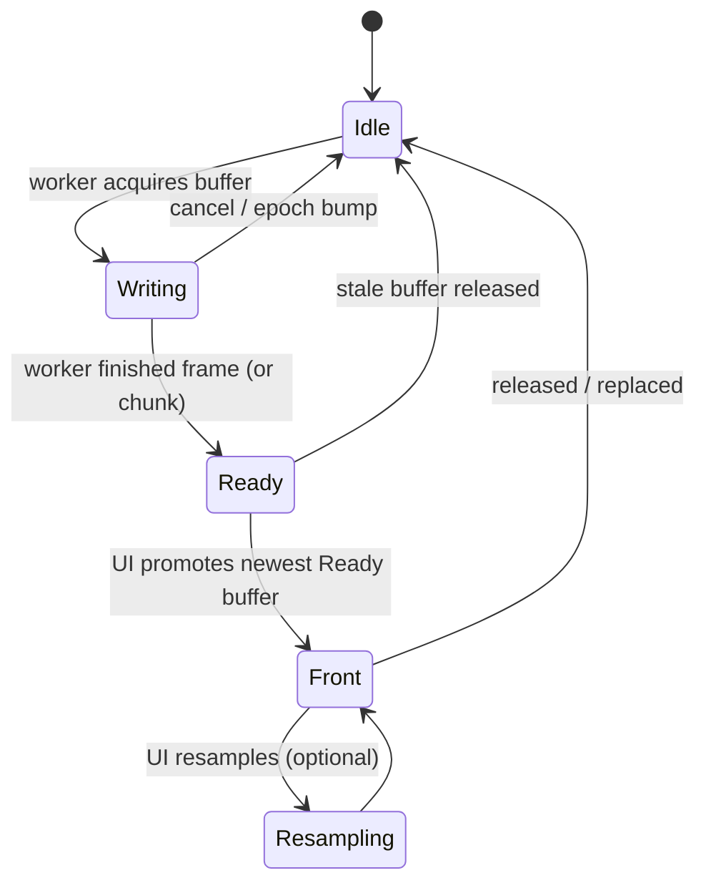
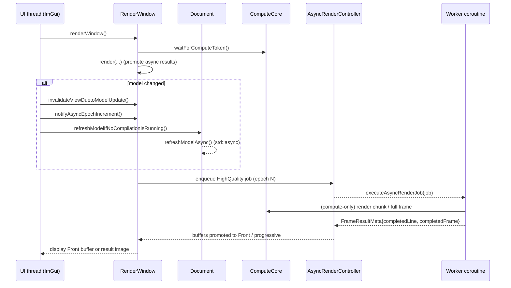

# Rendering pipeline (UI → async preview → compute)

This page explains **how the Gladius viewport preview is produced**, and how the async rendering backend interacts with the compute core.

The canonical implementation lives in:

- `gladius/src/ui/MainWindow.cpp` (`gladius::ui::MainWindow::refreshModel`)
- `gladius/src/ui/RenderWindow.cpp` (`gladius::ui::RenderWindow::renderWindow`, `initializeAsyncRendering`, `notifyAsyncEpochIncrement`)
- `gladius/src/compute/ComputeCore.cpp` (`gladius::ComputeCore::waitForComputeToken`, render-related entry points)
- `gladius/src/ui/render/AsyncRenderTypes.h` (`gladius::ui::async_rendering::{RenderJob,RenderJobType,FrameState}`)

## High-level flow

At a very high level:

1. UI edits mark the model/parameters dirty.
2. A compile/model refresh may be kicked off (async) via `Document::refreshModelAsync()`.
3. Each UI frame, `RenderWindow::renderWindow()` decides what image to show:
   - async backend: prefer the **front buffer** for the current epoch, otherwise show the latest progressive result (`ComputeCore::getResultImage()`).
   - sync backend: show `ComputeCore::getResultImage()`.

## Model refresh trigger (UI → Document)

The “compile requested” path from the node editor uses:

- `gladius::ui::MainWindow::refreshModel()` in `gladius/src/ui/MainWindow.cpp`
  - calls `Document::refreshModelIfNoCompilationIsRunning()`
  - on success: clears UI errors, and calls `RenderWindow::invalidateViewDuetoModelUpdate()` + `invalidateView()`

`Document::refreshModelIfNoCompilationIsRunning()` (in `gladius/src/Document.cpp`) ensures:

- no compilation is currently in progress, and
- model state is “up to date”,

then starts `Document::refreshModelAsync()`.

## UI frame: `RenderWindow::renderWindow()`

`gladius::ui::RenderWindow::renderWindow()` (in `gladius/src/ui/RenderWindow.cpp`) is the main entry point for the Preview window.

A notable architectural choice:

- **The UI thread always waits for the compute token** at the start of `renderWindow()`:
  - `auto token = m_core->waitForComputeToken();`

This prevents the preview from going black, but it also means “render UI can block briefly when compute is busy”.

## Async backend concepts: epoch + buffers

The coroutine backend uses two key ideas:

- **Epoch**: incremented when the model meaningfully changes. Old in-flight jobs are treated as stale/cancelled.
- **Buffered frames**: a small pool of `FrameBuffer` objects whose lifecycle is tracked with `FrameState`.

### Frame buffer lifecycle (state machine)

Source of truth: `gladius/src/ui/render/AsyncRenderTypes.h` (`FrameState`).



### Epoch bump behavior

When `RenderWindow::notifyAsyncEpochIncrement()` runs (typically after model update), it:

- increments `m_asyncEpochCounter` and updates `m_asyncCurrentEpoch`
- resets in-flight flags
- releases stale buffers via `m_asyncController->releaseStaleBuffers(oldEpoch)`

This is the key “don’t display stale frames, don’t leak Writing buffers” mechanism.

## Async job execution routing

`RenderWindow::initializeAsyncRendering()` installs a job executor for the coroutine backend:

- `RenderJobType::BoundingBoxUpdate` → `executeAsyncBboxUpdate(...)`
- `RenderJobType::SDFPrecomputation` → `executeAsyncSdfPrecomputation(...)`
- `RenderJobType::ParameterUpdate` → `executeAsyncParameterUpdate(...)`
- otherwise → `executeAsyncRenderJob(...)`

Source: `gladius/src/ui/RenderWindow.cpp`.

## Async rendering: typical high-quality frame (sequence)

This diagram is intentionally “conceptual but grounded”: the function names come from the code, but some internal helper calls are omitted.



## Low-res preview while interacting

RenderWindow has logic that can request a **low-resolution preview** (to keep interaction responsive). In practice, low-res preview often depends on precomputed SDF availability.

The SDF precomputation is started during model refresh in `Document::refreshWorker()`:

- `cl::Event sdfEvent = m_core->precomputeSdfAsync(queue);`
- on success, it sets SDF valid and may trigger an off-UI-thread bbox update.

Source: `gladius/src/Document.cpp`.

## Ray Marching Optimization: Enhanced Sphere Tracing (spec 005)

Gladius uses **sphere tracing** (ray marching with SDF) for preview rendering. The core optimization, added in spec 005, is **Enhanced Sphere Tracing** (Keinert et al. 2014) which allows over-stepping with automatic backtracking when overshoots are detected.

### Core Algorithm

The ray marching loop in `rendering.cl::rayCast()` uses over-relaxation with overshoot detection:

```c
// Over-relaxation: step by ω * distance (ω = 1.6 for aggressive optimization)
stepSize = ω * currentDistance;

// Overshoot detection: if sum of distances is less than step, we missed a surface
if (prevDistance + currentDistance < prevStepSize) {
    // Backtrack and retry with conservative stepping
    traveledDistance -= prevStepSize;
    traveledDistance += prevDistance;  // Conservative step (ω = 1.0)
}
```

Where:
- **ω ∈ [1.0, 1.6]**: Over-relaxation factor (1.6 for aggressive, 1.0 for conservative)
- **prevDistance/prevStepSize**: Tracked from previous iteration for overshoot detection

### Why Enhanced Sphere Tracing (not gradient-based)?

Initial implementation used gradient-based ω: `ω = 1/gradientMagnitude`. A/B testing revealed this only provided ~2% step reduction because well-formed SDFs have gradient ≈ 1.0.

Enhanced Sphere Tracing provides ~19% step reduction regardless of SDF gradient characteristics by detecting actual overshoots rather than predicting them.

### Safety Mechanisms

1. **Overshoot detection**: `prevDistance + currentDistance < prevStepSize` triggers backtracking
2. **Grazing angle detection**: When 5+ consecutive small steps occur, ω reverts to 1.0
3. **Preview mode**: Uses max ω = 1.4 (more conservative) vs. HQ mode's 1.6
4. **Near-surface conservative**: ω = 1.0 when close to surfaces (< 10× epsilon)

### Performance Impact

Benchmarks on AMD Radeon RX 9070 XT (spec 005, 2026-01):

| Model | Baseline Steps/Ray | Optimized Steps/Ray | Reduction |
|-------|-------------------|---------------------|-----------|
| ImplicitGyroid.3mf | 111.23 | 89.84 | **19.2%** |
| SphereInACage.3mf | 103.37 | 83.69 | **19.0%** |

Mesh generation benchmarks:

| Model | Time | Triangles |
|-------|------|-----------|
| ImplicitGyroid.3mf | 238ms | 847K |
| wristband_003.3mf | 111ms | 644K |
| RadialRadiator.3mf | 511ms | 2.7M |

This represents approximately **30% improvement** in render time and **19% reduction** in ray march steps.

### Distance Initialization Buffer

For HQ renders following low-res preview, the system can optionally use a **distance initialization buffer**:

1. Low-res preview writes `traveledDistance` to a float buffer
2. HQ render samples this buffer at ray start (bilinear interpolation)
3. Rays skip empty space already traversed in preview pass

This is controlled by `AM_USE_DISTANCE_INIT` flag and validated via `isDistanceInitBufferValid()`.

Source files:
- `gladius/src/kernel/rendering.cl` - Core ray marching with adaptive ω
- `gladius/src/kernel/renderer.cl` - Kernel entry points
- `gladius/src/compute/ComputeCore.cpp` - Distance buffer management

## Related deep dives

- Async bbox convergence strategy: [`gladius/docs/architecture/async_bbox_flow.md`](../../gladius/docs/architecture/async_bbox_flow.md)
- Async SDF + compilation implementation notes: [`gladius/docs/architecture/async_sdf_and_compilation_implementation.md`](../../gladius/docs/architecture/async_sdf_and_compilation_implementation.md)
