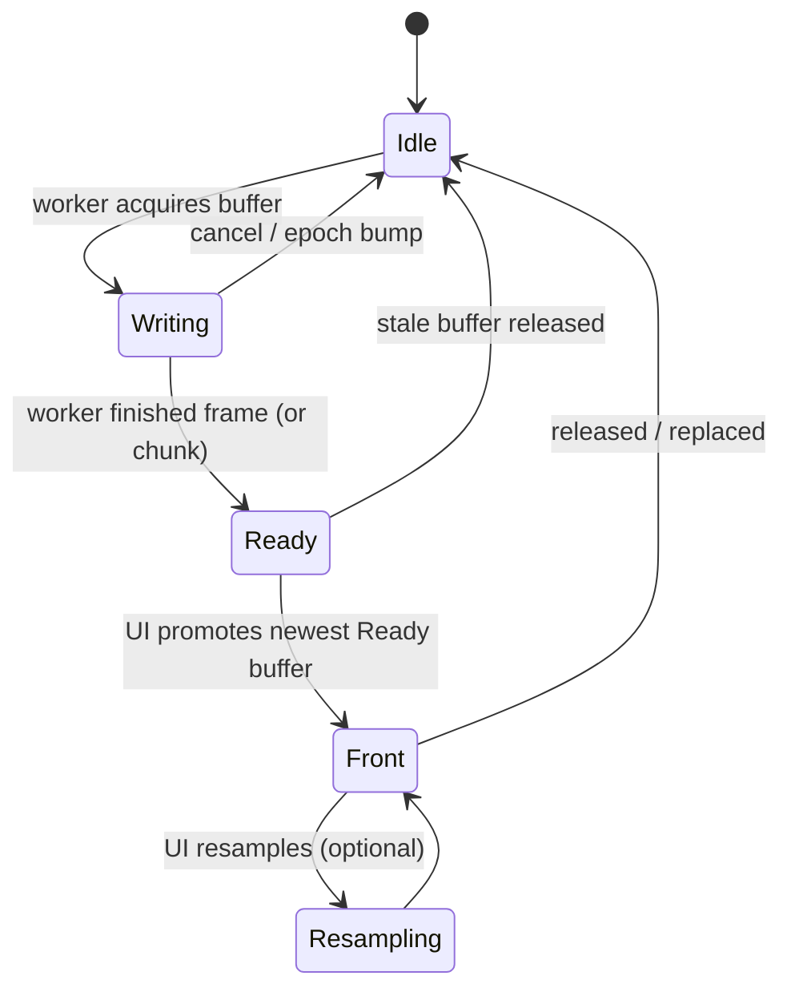
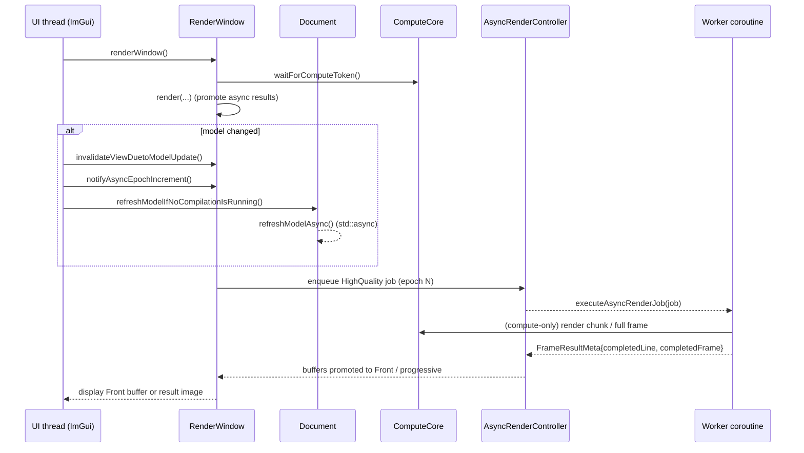

# Rendering pipeline (UI → async preview → compute)

This page explains **how the Gladius viewport preview is produced**, and how the async rendering backend interacts with the compute core.

The canonical implementation lives in:

- `gladius/src/ui/MainWindow.cpp` (`gladius::ui::MainWindow::refreshModel`)
- `gladius/src/ui/RenderWindow.cpp` (`gladius::ui::RenderWindow::renderWindow`, `initializeAsyncRendering`, `notifyAsyncEpochIncrement`)
- `gladius/src/compute/ComputeCore.cpp` (`gladius::ComputeCore::waitForComputeToken`, render-related entry points)
- `gladius/src/ui/render/AsyncRenderTypes.h` (`gladius::ui::async_rendering::{RenderJob,RenderJobType,FrameState}`)

## High-level flow

At a very high level:

1. UI edits mark the model/parameters dirty.
2. A compile/model refresh may be kicked off (async) via `Document::refreshModelAsync()`.
3. Each UI frame, `RenderWindow::renderWindow()` decides what image to show:
   - async backend: prefer the **front buffer** for the current epoch, otherwise show the latest progressive result (`ComputeCore::getResultImage()`).
   - sync backend: show `ComputeCore::getResultImage()`.

## Model refresh trigger (UI → Document)

The “compile requested” path from the node editor uses:

- `gladius::ui::MainWindow::refreshModel()` in `gladius/src/ui/MainWindow.cpp`
  - calls `Document::refreshModelIfNoCompilationIsRunning()`
  - on success: clears UI errors, and calls `RenderWindow::invalidateViewDuetoModelUpdate()` + `invalidateView()`

`Document::refreshModelIfNoCompilationIsRunning()` (in `gladius/src/Document.cpp`) ensures:

- no compilation is currently in progress, and
- model state is “up to date”,

then starts `Document::refreshModelAsync()`.

## UI frame: `RenderWindow::renderWindow()`

`gladius::ui::RenderWindow::renderWindow()` (in `gladius/src/ui/RenderWindow.cpp`) is the main entry point for the Preview window.

A notable architectural choice:

- **The UI thread always waits for the compute token** at the start of `renderWindow()`:
  - `auto token = m_core->waitForComputeToken();`

This prevents the preview from going black, but it also means “render UI can block briefly when compute is busy”.

## Async backend concepts: epoch + buffers

The coroutine backend uses two key ideas:

- **Epoch**: incremented when the model meaningfully changes. Old in-flight jobs are treated as stale/cancelled.
- **Buffered frames**: a small pool of `FrameBuffer` objects whose lifecycle is tracked with `FrameState`.

### Frame buffer lifecycle (state machine)

Source of truth: `gladius/src/ui/render/AsyncRenderTypes.h` (`FrameState`).

### Epoch bump behavior

When `RenderWindow::notifyAsyncEpochIncrement()` runs (typically after model update), it:

- increments `m_asyncEpochCounter` and updates `m_asyncCurrentEpoch`
- resets in-flight flags
- releases stale buffers via `m_asyncController->releaseStaleBuffers(oldEpoch)`

This is the key “don’t display stale frames, don’t leak Writing buffers” mechanism.

## Async job execution routing

`RenderWindow::initializeAsyncRendering()` installs a job executor for the coroutine backend:

- `RenderJobType::BoundingBoxUpdate` → `executeAsyncBboxUpdate(...)`
- `RenderJobType::SDFPrecomputation` → `executeAsyncSdfPrecomputation(...)`
- `RenderJobType::ParameterUpdate` → `executeAsyncParameterUpdate(...)`
- otherwise → `executeAsyncRenderJob(...)`

Source: `gladius/src/ui/RenderWindow.cpp`.

## Async rendering: typical high-quality frame (sequence)

This diagram is intentionally “conceptual but grounded”: the function names come from the code, but some internal helper calls are omitted.

## Low-res preview while interacting

RenderWindow has logic that can request a **low-resolution preview** (to keep interaction responsive). In practice, low-res preview often depends on precomputed SDF availability.

The SDF precomputation is started during model refresh in `Document::refreshWorker()`:

- `cl::Event sdfEvent = m_core->precomputeSdfAsync(queue);`
- on success, it sets SDF valid and may trigger an off-UI-thread bbox update.

Source: `gladius/src/Document.cpp`.

## Related deep dives

- Async bbox convergence strategy: [`gladius/docs/architecture/async_bbox_flow.md`](../../gladius/docs/architecture/async_bbox_flow.md)
- Async SDF + compilation implementation notes: [`gladius/docs/architecture/async_sdf_and_compilation_implementation.md`](../../gladius/docs/architecture/async_sdf_and_compilation_implementation.md)
