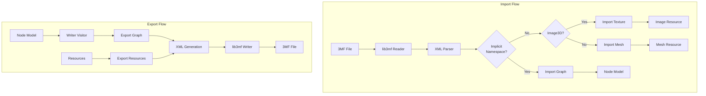
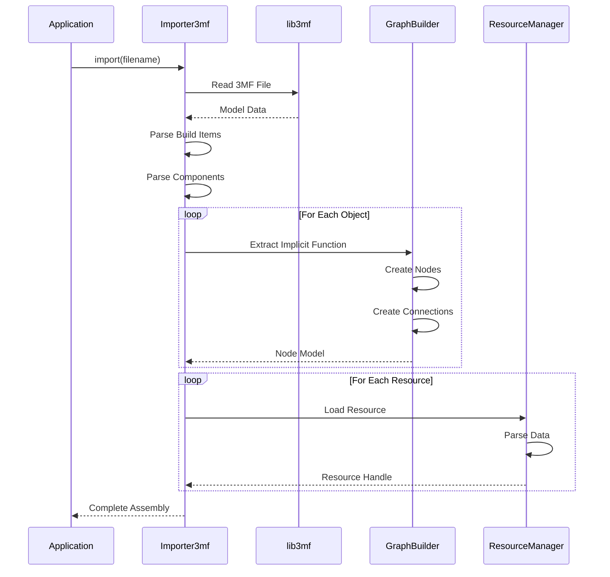
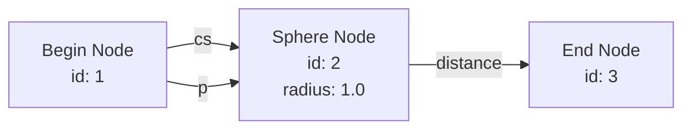
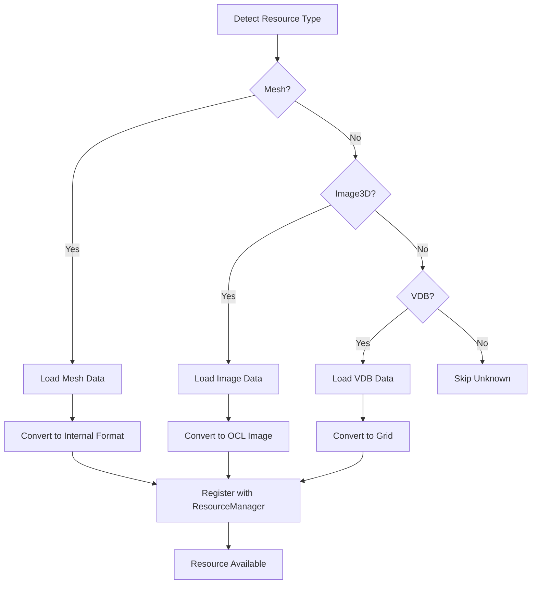
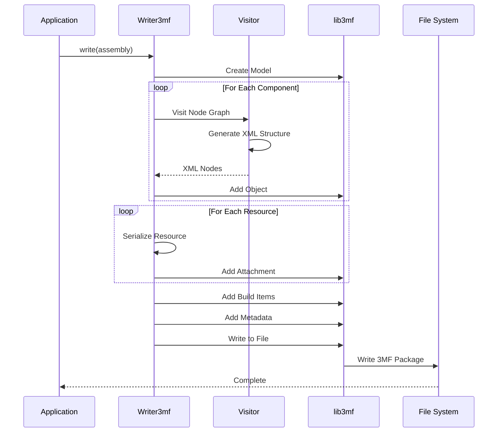
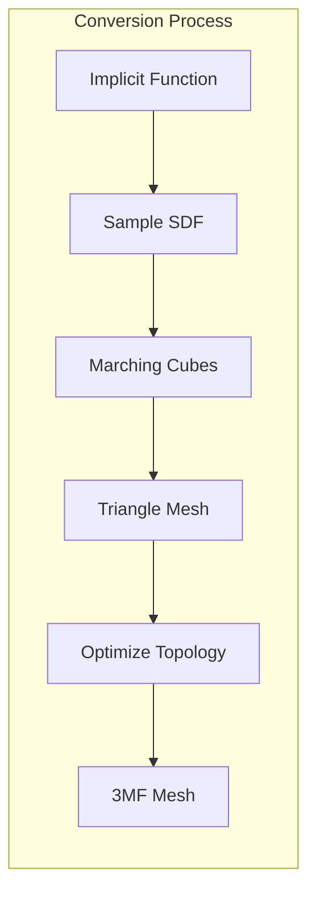
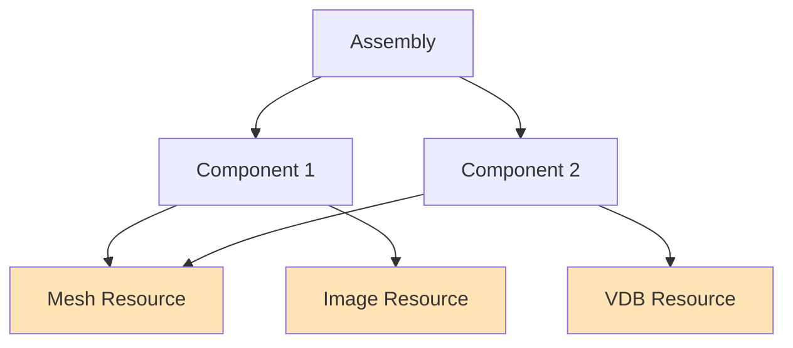
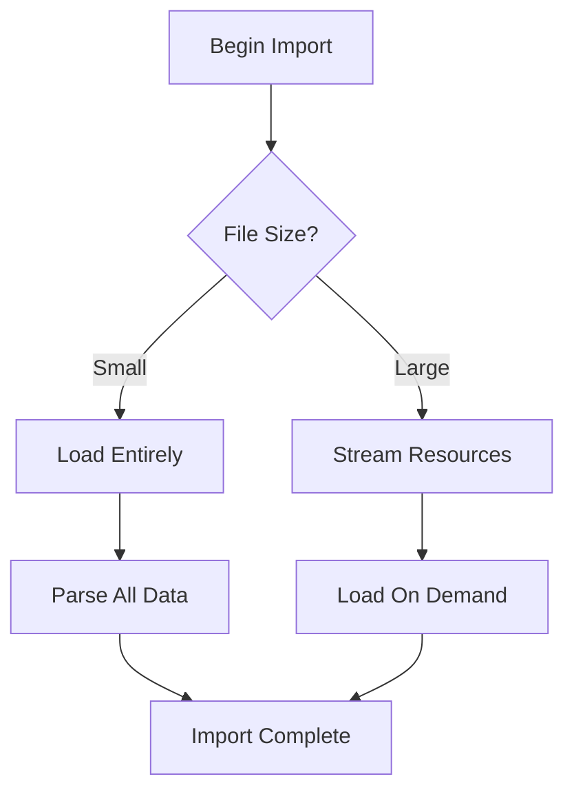

# 3MF Import/Export System Documentation

## Overview

Gladius provides comprehensive support for the 3MF file format with the Volumetric Extension, enabling import and export of implicit geometries defined through function graphs. The system bridges between the 3MF XML representation and Gladius's internal node graph structure.

## 3MF Volumetric Extension

The 3MF Volumetric Extension defines two main approaches for representing implicit geometries:

1. **Implicit Namespace**: Function graphs defined as node networks
2. **Image3D**: Volumetric data stored as 3D textures

Gladius supports both approaches for maximum compatibility.

## Architecture



## Import System

### Importer3mf Class

The main entry point for importing 3MF files:

```cpp
class Importer3mf {
public:
    Importer3mf(const std::filesystem::path& filename);
    
    // Import entire assembly
    nodes::SharedAssembly import();
    
    // Import specific model
    nodes::Model importModel(lib3mf::CModel& model);
    
    // Import resources
    void importResources(lib3mf::CModel& model, 
                        nodes::Assembly& assembly);
};
```

### Import Process



### Implicit Function Graph Import

The system translates 3MF implicit function definitions to node graphs:

**3MF XML Example:**
```xml
<model xmlns="http://schemas.microsoft.com/3dmanufacturing/core/2015/02"
       xmlns:impl="http://schemas.3mf.io/3dmanufacturing/implicit/2024/03">
  <resources>
    <object id="1" type="model">
      <impl:implicitfunction>
        <!-- Begin node -->
        <impl:node id="1" type="impl:begin">
          <impl:output name="cs" portid="1"/>
          <impl:output name="p" portid="2"/>
        </impl:node>
        
        <!-- Sphere primitive -->
        <impl:node id="2" type="impl:sphere">
          <impl:input name="cs" portid="1"/>
          <impl:input name="center">
            <impl:const>
              <impl:vector>0 0 0</impl:vector>
            </impl:const>
          </impl:input>
          <impl:input name="radius">
            <impl:const>
              <impl:scalar>1.0</impl:scalar>
            </impl:const>
          </impl:input>
          <impl:output name="distance" portid="3"/>
        </impl:node>
        
        <!-- End node -->
        <impl:node id="3" type="impl:end">
          <impl:input name="result" portid="3"/>
        </impl:node>
      </impl:implicitfunction>
    </object>
  </resources>
  
  <build>
    <item objectid="1"/>
  </build>
</model>
```

**Corresponding Node Graph:**


### Node Type Mapping

The importer maps 3MF node types to Gladius node types:

| 3MF Type | Gladius Node | Description |
|----------|--------------|-------------|
| `impl:begin` | Begin | Function entry point |
| `impl:end` | End | Function exit point |
| `impl:sphere` | Sphere | Sphere primitive |
| `impl:box` | Box | Box primitive |
| `impl:cylinder` | Cylinder | Cylinder primitive |
| `impl:union` | Union | Boolean union |
| `impl:intersection` | Intersection | Boolean intersection |
| `impl:difference` | Difference | Boolean difference |
| `impl:add` | Add | Scalar addition |
| `impl:multiply` | Multiply | Scalar multiplication |
| `impl:mesh` | MeshResource | Mesh-based SDF |
| `impl:image3d` | ImageStackResource | 3D texture sampling |

### Resource Import

Resources are loaded and registered with the ResourceManager:



### Image3D Import

Image3D resources store volumetric data as 3D textures:

```xml
<impl:image3d id="100" 
              width="256" 
              height="256" 
              depth="256"
              format="float32">
  <impl:data encoding="base64">
    <!-- Base64-encoded volume data -->
  </impl:data>
</impl:image3d>
```

Import process:
1. Decode base64 data
2. Parse according to format (float32, uint8, etc.)
3. Upload to OpenCL image buffer
4. Create ImageStackResource reference

## Export System

### Writer3mf Class

The main entry point for exporting to 3MF:

```cpp
class Writer3mf {
public:
    Writer3mf(const std::filesystem::path& filename);
    
    // Export assembly to 3MF
    void write(const nodes::Assembly& assembly);
    
    // Export with options
    void write(const nodes::Assembly& assembly, 
              const ExportOptions& options);
    
private:
    void writeModel(lib3mf::CModel& model, 
                   const nodes::Model& nodeModel);
    void writeResources(lib3mf::CModel& model,
                       const nodes::Assembly& assembly);
};
```

### Export Process



### Node Graph Export

The export system traverses the node graph and generates 3MF XML:

```cpp
class ToXMLVisitor : public Visitor {
public:
    void visit(NodeBase& node) override {
        // Generate XML for this node
        auto xmlNode = createXMLNode(node);
        
        // Export parameters
        for (const auto& param : node.getParameters()) {
            xmlNode.addParameter(param);
        }
        
        // Export connections
        for (const auto& input : node.getInputs()) {
            if (input.isConnected()) {
                xmlNode.addConnection(input.getConnectedPort());
            }
        }
        
        m_xmlNodes.push_back(xmlNode);
    }
    
private:
    std::vector<XMLNode> m_xmlNodes;
};
```

### Export Options

Various options control the export process:

```cpp
struct ExportOptions {
    bool embedResources{true};        // Embed or reference externally
    bool optimizeGraph{true};         // Remove unused nodes
    bool includeMetadata{true};       // Export metadata
    ImageFormat imageFormat{Float32}; // Format for Image3D
    int imageResolution{256};         // Resolution for Image3D
};
```

### Mesh Export from Implicit Functions

Gladius can generate explicit meshes from implicit functions:



**Process:**
1. **Sample SDF**: Evaluate implicit function on regular grid
2. **Marching Cubes**: Extract isosurface at distance = 0
3. **Optimize**: Remove duplicate vertices, fix topology
4. **Export**: Write as standard 3MF mesh

### Resource Dependencies

The exporter tracks resource dependencies to ensure all required resources are included:



**Dependency Resolution:**
```cpp
class ResourceDependencyGraph {
public:
    // Add resource dependency
    void addDependency(ResourceId source, ResourceId target);
    
    // Get all dependencies
    std::vector<ResourceId> getAllDependencies(ResourceId root);
    
    // Topologically sort resources
    std::vector<ResourceId> getExportOrder();
};
```

## Function Comparator

When exporting, the system can detect identical functions and share them:

```cpp
class FunctionComparator {
public:
    // Compare two node graphs for equality
    bool areEqual(const nodes::Model& a, const nodes::Model& b);
    
    // Compute hash for quick comparison
    size_t computeHash(const nodes::Model& model);
    
private:
    bool compareNodes(const NodeBase& a, const NodeBase& b);
    bool compareConnections(const Model& a, const Model& b);
};
```

**Benefits:**
- Reduced file size
- Faster loading
- Better memory usage

## Metadata Handling

### Standard Metadata

Gladius supports standard 3MF metadata:

```xml
<metadata name="Title">My Part</metadata>
<metadata name="Designer">John Doe</metadata>
<metadata name="Description">Example part with implicit geometry</metadata>
<metadata name="CreationDate">2024-01-15T10:30:00Z</metadata>
<metadata name="Application">Gladius</metadata>
<metadata name="Version">1.2.0</metadata>
```

### Custom Metadata

Gladius-specific metadata for preserving application state:

```xml
<metadata name="Gladius:Camera">
  <position>0 0 10</position>
  <target>0 0 0</target>
  <up>0 1 0</up>
</metadata>
<metadata name="Gladius:ViewMode">Rendered</metadata>
<metadata name="Gladius:NodeLayout">
  <!-- Node positions in editor -->
</metadata>
```

## Error Handling

### Import Errors

Common import errors and their handling:

| Error | Cause | Resolution |
|-------|-------|------------|
| Invalid XML | Malformed 3MF file | Report parse error with line number |
| Unknown node type | Unsupported node type | Skip node or use fallback |
| Missing resource | Referenced resource not found | Create placeholder or report error |
| Cyclic graph | Invalid node connections | Reject import, show error |
| Version mismatch | Incompatible 3MF version | Attempt compatibility mode |

### Export Errors

Common export errors and their handling:

| Error | Cause | Resolution |
|-------|-------|------------|
| Unsupported feature | Node type not in 3MF spec | Convert to supported equivalent |
| Resource too large | Image/mesh exceeds size limit | Downsample or split |
| Invalid graph | Begin/End missing | Validate before export |
| Write failure | Disk full, permissions | Report I/O error |

## Validation

### Import Validation

The importer validates imported data:

```cpp
class GraphValidator {
public:
    struct ValidationResult {
        bool valid;
        std::vector<std::string> errors;
        std::vector<std::string> warnings;
    };
    
    ValidationResult validate(const nodes::Model& model);
    
private:
    bool checkBeginEnd(const Model& model);
    bool checkConnections(const Model& model);
    bool checkCycles(const Model& model);
    bool checkTypes(const Model& model);
};
```

**Validation Checks:**
- Begin and End nodes present
- All required inputs connected
- No cycles in graph
- Type compatibility of connections
- Valid parameter values

### Export Validation

Before exporting, the system validates:
- Graph is complete and valid
- All resources are available
- No unsupported features used
- File can be written to destination

## Performance Considerations

### Large Files

For large 3MF files with embedded resources:

1. **Streaming**: Read resources on-demand rather than loading all at once
2. **Compression**: Use ZIP compression within 3MF package
3. **Progress Reporting**: Show progress for long operations
4. **Chunking**: Process resources in chunks

### Memory Usage



## Compatibility

### 3MF Specification Versions

Gladius supports:
- **3MF Core 1.3**: Base specification
- **Volumetric Extension Draft**: Implicit functions
- **Materials and Properties**: Basic material support

### Backward Compatibility

When exporting, Gladius can target different specification versions:

```cpp
enum class SpecVersion {
    Core_1_0,
    Core_1_3,
    Volumetric_Draft
};

ExportOptions options;
options.targetVersion = SpecVersion::Core_1_3;
```

## Example Workflows

### Import and Modify

```cpp
// Import 3MF file
Importer3mf importer("input.3mf");
auto assembly = importer.import();

// Modify node graph
auto& model = assembly->getModel();
auto sphereNode = model.getNode(nodeId);
sphereNode->setParameter("radius", 2.0f);

// Export modified version
Writer3mf writer("output.3mf");
writer.write(*assembly);
```

### Batch Conversion

```cpp
// Convert multiple 3MF files
for (const auto& file : inputFiles) {
    Importer3mf importer(file);
    auto assembly = importer.import();
    
    // Apply transformations
    processAssembly(*assembly);
    
    // Export as STL
    MeshExporter exporter(file.replace_extension(".stl"));
    exporter.exportMesh(*assembly);
}
```

### Resource Extraction

```cpp
// Extract resources from 3MF
Importer3mf importer("model.3mf");
auto assembly = importer.import();

// Save resources separately
for (const auto& resource : assembly->getResources()) {
    if (auto mesh = dynamic_cast<MeshResource*>(resource)) {
        mesh->save(mesh->getName() + ".stl");
    }
    if (auto image = dynamic_cast<ImageStackResource*>(resource)) {
        image->save(image->getName() + ".raw");
    }
}
```

## Testing

### Unit Tests

Test individual import/export operations:

```cpp
TEST(Writer3mf_Tests, ExportSimpleSphere) {
    // Create model with sphere
    nodes::Model model;
    model.createBeginEnd();
    auto sphere = model.addNode(std::make_unique<nodes::Sphere>());
    model.connect(/* ... */);
    
    // Export
    Writer3mf writer("test_sphere.3mf");
    writer.write(model);
    
    // Verify file exists and is valid
    ASSERT_TRUE(std::filesystem::exists("test_sphere.3mf"));
}
```

### Integration Tests

Test round-trip import/export:

```cpp
TEST(Importer3mf_tests, RoundTripEquality) {
    // Export original
    Writer3mf writer1("original.3mf");
    writer1.write(originalAssembly);
    
    // Import
    Importer3mf importer("original.3mf");
    auto imported = importer.import();
    
    // Export again
    Writer3mf writer2("reimported.3mf");
    writer2.write(*imported);
    
    // Compare models
    FunctionComparator comparator;
    ASSERT_TRUE(comparator.areEqual(
        originalAssembly.getModel(),
        imported->getModel()
    ));
}
```

## Future Enhancements

- **Streaming Import**: Support for extremely large files
- **Incremental Export**: Update existing 3MF files without full rewrite
- **Parallel Processing**: Multi-threaded resource loading
- **Advanced Compression**: Better compression for volumetric data
- **Cloud Integration**: Direct import/export from cloud storage
- **Version Control**: Track changes between 3MF file versions

## Related Documentation

- [Architecture Overview](ARCHITECTURE.md)
- [Node System Documentation](NODE_SYSTEM.md)
- [Resource Management](RESOURCE_MANAGEMENT.md)
- [API Reference](API_REFERENCE.md)
