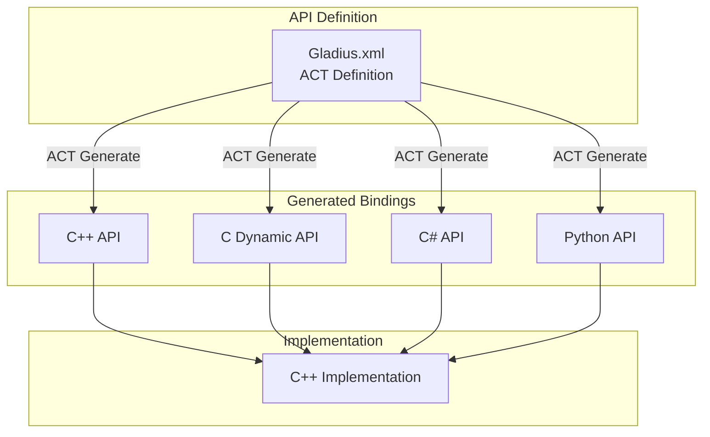
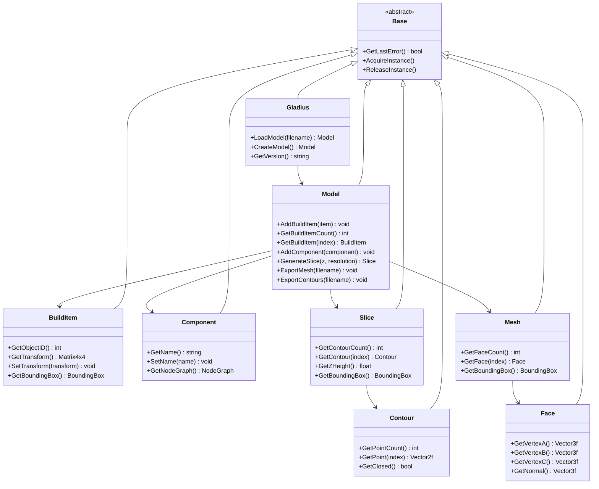

# API Reference Documentation

## Overview

Gladius provides a comprehensive API for programmatic access to its functionality. The API is generated using the Automatic Component Toolkit (ACT), enabling bindings for multiple programming languages including C++, C#, and Python.

## Language Bindings

The API is available in multiple languages:

- **C++**: Native C++ interface with modern C++17 features
- **C**: Dynamic C interface for maximum compatibility
- **C#**: .NET bindings with C# conventions
- **Python**: Python 3.x bindings with Pythonic interface



## Core API Structure

### Class Hierarchy



## API Methods

### Gladius Class

The main entry point for the API.

#### CreateGladius()
```cpp
// C++
Gladius* gladius = CreateGladius();

// C#
var gladius = new Gladius();

// Python
gladius = gladiuslib.CreateGladius()
```

Creates a new Gladius instance.

**Returns:** Pointer/reference to Gladius instance

#### GetVersion()
```cpp
// C++
uint32_t major, minor, micro;
gladius->GetVersion(major, minor, micro);

// C#
gladius.GetVersion(out uint major, out uint minor, out uint micro);

// Python
major, minor, micro = gladius.GetVersion()
```

Retrieves the library version.

**Parameters:**
- `major` (out): Major version number
- `minor` (out): Minor version number
- `micro` (out): Micro version number

#### LoadModel()
```cpp
// C++
Model* model = gladius->LoadModel("model.3mf");

// C#
var model = gladius.LoadModel("model.3mf");

// Python
model = gladius.LoadModel("model.3mf")
```

Loads a 3MF model from file.

**Parameters:**
- `filename` (string): Path to 3MF file

**Returns:** Model instance

**Throws:** Exception if file not found or invalid

#### CreateModel()
```cpp
// C++
Model* model = gladius->CreateModel();

// C#
var model = gladius.CreateModel();

// Python
model = gladius.CreateModel()
```

Creates an empty model.

**Returns:** New Model instance

### Model Class

Represents a 3D model with implicit geometry.

#### AddBuildItem()
```cpp
// C++
model->AddBuildItem(objectID, transform);

// C#
model.AddBuildItem(objectID, transform);

// Python
model.AddBuildItem(objectID, transform)
```

Adds a build item to the model.

**Parameters:**
- `objectID` (int): ID of the object to build
- `transform` (Matrix4x4): Transformation matrix

#### GetBuildItemCount()
```cpp
// C++
uint32_t count = model->GetBuildItemCount();

// C#
uint count = model.GetBuildItemCount();

// Python
count = model.GetBuildItemCount()
```

Gets the number of build items.

**Returns:** Number of build items

#### GetBuildItem()
```cpp
// C++
BuildItem* item = model->GetBuildItem(0);

// C#
var item = model.GetBuildItem(0);

// Python
item = model.GetBuildItem(0)
```

Gets a build item by index.

**Parameters:**
- `index` (int): Build item index (0-based)

**Returns:** BuildItem instance

#### GenerateSlice()
```cpp
// C++
Slice* slice = model->GenerateSlice(5.0f, 1024);

// C#
var slice = model.GenerateSlice(5.0f, 1024);

// Python
slice = model.GenerateSlice(5.0, 1024)
```

Generates a 2D slice at specified Z-height.

**Parameters:**
- `zHeight` (float): Z-coordinate of the slice plane
- `resolution` (int): Resolution of the slice image

**Returns:** Slice instance containing contours

#### ExportMesh()
```cpp
// C++
model->ExportMesh("output.stl");

// C#
model.ExportMesh("output.stl");

// Python
model.ExportMesh("output.stl")
```

Exports the model as a triangle mesh.

**Parameters:**
- `filename` (string): Output file path
- Supported formats: STL, 3MF

**Throws:** Exception if export fails

#### ExportContours()
```cpp
// C++
model->ExportContours("output.svg", 0.0f, 10.0f, 0.1f);

// C#
model.ExportContours("output.svg", 0.0f, 10.0f, 0.1f);

// Python
model.ExportContours("output.svg", 0.0, 10.0, 0.1)
```

Exports contours for a range of Z-heights.

**Parameters:**
- `filename` (string): Output file path (SVG or CLI format)
- `zMin` (float): Minimum Z-height
- `zMax` (float): Maximum Z-height
- `zStep` (float): Z-height increment

#### GetBoundingBox()
```cpp
// C++
BoundingBox* bbox = model->GetBoundingBox();
Vector3f min = bbox->GetMin();
Vector3f max = bbox->GetMax();

// C#
var bbox = model.GetBoundingBox();
var min = bbox.GetMin();
var max = bbox.GetMax();

// Python
bbox = model.GetBoundingBox()
min_pt = bbox.GetMin()
max_pt = bbox.GetMax()
```

Gets the axis-aligned bounding box.

**Returns:** BoundingBox instance

### BuildItem Class

Represents an instance of an object in the build volume.

#### GetObjectID()
```cpp
// C++
uint32_t objectID = buildItem->GetObjectID();

// C#
uint objectID = buildItem.GetObjectID();

// Python
object_id = buildItem.GetObjectID()
```

Gets the ID of the referenced object.

**Returns:** Object ID

#### GetTransform()
```cpp
// C++
Matrix4x4 transform = buildItem->GetTransform();

// C#
var transform = buildItem.GetTransform();

// Python
transform = buildItem.GetTransform()
```

Gets the transformation matrix.

**Returns:** 4x4 transformation matrix

#### SetTransform()
```cpp
// C++
Matrix4x4 transform = /* ... */;
buildItem->SetTransform(transform);

// C#
var transform = /* ... */;
buildItem.SetTransform(transform);

// Python
transform = # ...
buildItem.SetTransform(transform)
```

Sets the transformation matrix.

**Parameters:**
- `transform` (Matrix4x4): New transformation

### Slice Class

Represents a 2D slice of the model.

#### GetContourCount()
```cpp
// C++
uint32_t count = slice->GetContourCount();

// C#
uint count = slice.GetContourCount();

// Python
count = slice.GetContourCount()
```

Gets the number of contours in the slice.

**Returns:** Number of contours

#### GetContour()
```cpp
// C++
Contour* contour = slice->GetContour(0);

// C#
var contour = slice.GetContour(0);

// Python
contour = slice.GetContour(0)
```

Gets a contour by index.

**Parameters:**
- `index` (int): Contour index (0-based)

**Returns:** Contour instance

#### GetZHeight()
```cpp
// C++
float z = slice->GetZHeight();

// C#
float z = slice.GetZHeight();

// Python
z = slice.GetZHeight()
```

Gets the Z-height of the slice.

**Returns:** Z-coordinate

### Contour Class

Represents a closed or open 2D contour.

#### GetPointCount()
```cpp
// C++
uint32_t count = contour->GetPointCount();

// C#
uint count = contour.GetPointCount();

// Python
count = contour.GetPointCount()
```

Gets the number of points in the contour.

**Returns:** Number of points

#### GetPoint()
```cpp
// C++
Vector2f point = contour->GetPoint(0);

// C#
var point = contour.GetPoint(0);

// Python
point = contour.GetPoint(0)
```

Gets a point by index.

**Parameters:**
- `index` (int): Point index (0-based)

**Returns:** 2D point coordinates

#### GetClosed()
```cpp
// C++
bool closed = contour->GetClosed();

// C#
bool closed = contour.GetClosed();

// Python
closed = contour.GetClosed()
```

Checks if the contour is closed.

**Returns:** True if closed, false if open

### Mesh Class

Represents a triangle mesh (for mesh export).

#### GetFaceCount()
```cpp
// C++
uint32_t count = mesh->GetFaceCount();

// C#
uint count = mesh.GetFaceCount();

// Python
count = mesh.GetFaceCount()
```

Gets the number of triangular faces.

**Returns:** Number of faces

#### GetFace()
```cpp
// C++
Face* face = mesh->GetFace(0);

// C#
var face = mesh.GetFace(0);

// Python
face = mesh.GetFace(0)
```

Gets a face by index.

**Parameters:**
- `index` (int): Face index (0-based)

**Returns:** Face instance

### Face Class

Represents a triangular face.

#### GetVertexA/B/C()
```cpp
// C++
Vector3f va = face->GetVertexA();
Vector3f vb = face->GetVertexB();
Vector3f vc = face->GetVertexC();

// C#
var va = face.GetVertexA();
var vb = face.GetVertexB();
var vc = face.GetVertexC();

// Python
va = face.GetVertexA()
vb = face.GetVertexB()
vc = face.GetVertexC()
```

Gets the three vertices of the triangle.

**Returns:** 3D vertex coordinates

#### GetNormal()
```cpp
// C++
Vector3f normal = face->GetNormal();

// C#
var normal = face.GetNormal();

// Python
normal = face.GetNormal()
```

Gets the face normal.

**Returns:** 3D normal vector

## Data Types

### Vector2f
```cpp
struct Vector2f {
    float x, y;
};
```

### Vector3f
```cpp
struct Vector3f {
    float x, y, z;
};
```

### Matrix4x4
```cpp
struct Matrix4x4 {
    float m[16];  // Column-major order
};
```

## Error Handling

All API methods can throw exceptions. Always use appropriate error handling:

### C++
```cpp
try {
    Model* model = gladius->LoadModel("model.3mf");
    // Use model
} catch (const GladiusException& e) {
    std::cerr << "Error: " << e.what() << std::endl;
}
```

### C#
```cpp
try {
    var model = gladius.LoadModel("model.3mf");
    // Use model
} catch (GladiusException e) {
    Console.WriteLine($"Error: {e.Message}");
}
```

### Python
```python
try:
    model = gladius.LoadModel("model.3mf")
    # Use model
except gladiuslib.GladiusException as e:
    print(f"Error: {e}")
```

## Usage Examples

### Load and Slice

```cpp
// C++
auto gladius = CreateGladius();
auto model = gladius->LoadModel("input.3mf");

// Generate slices
for (float z = 0.0f; z < 10.0f; z += 0.1f) {
    auto slice = model->GenerateSlice(z, 2048);
    
    // Process each contour
    for (uint32_t i = 0; i < slice->GetContourCount(); i++) {
        auto contour = slice->GetContour(i);
        // Process contour points
    }
}
```

```python
# Python
gladius = gladiuslib.CreateGladius()
model = gladius.LoadModel("input.3mf")

# Generate slices
for z in range(0, 100, 1):  # 0 to 10mm in 0.1mm steps
    slice_obj = model.GenerateSlice(z / 10.0, 2048)
    
    # Process each contour
    for i in range(slice_obj.GetContourCount()):
        contour = slice_obj.GetContour(i)
        # Process contour points
```

### Export Mesh

```cpp
// C++
auto gladius = CreateGladius();
auto model = gladius->LoadModel("input.3mf");

// Export as STL
model->ExportMesh("output.stl");
```

```csharp
// C#
var gladius = new Gladius();
var model = gladius.LoadModel("input.3mf");

// Export as STL
model.ExportMesh("output.stl");
```

### Batch Processing

```python
# Python
import gladiuslib
import os

gladius = gladiuslib.CreateGladius()

# Process all 3MF files in directory
for filename in os.listdir("input"):
    if filename.endswith(".3mf"):
        model = gladius.LoadModel(f"input/{filename}")
        
        # Export as STL
        output_name = filename.replace(".3mf", ".stl")
        model.ExportMesh(f"output/{output_name}")
        
        print(f"Processed {filename}")
```

### Integration with Slicer

```cpp
// C++ slicer integration
class GladiusSlicer {
public:
    void sliceModel(const std::string& filename) {
        auto gladius = CreateGladius();
        auto model = gladius->LoadModel(filename);
        
        // Get bounding box
        auto bbox = model->GetBoundingBox();
        auto min = bbox->GetMin();
        auto max = bbox->GetMax();
        
        // Generate slices
        float layerHeight = 0.2f;  // 0.2mm layers
        for (float z = min.z; z <= max.z; z += layerHeight) {
            auto slice = model->GenerateSlice(z, 4096);
            
            // Convert to toolpaths
            generateToolpaths(slice);
        }
    }
    
private:
    void generateToolpaths(Slice* slice) {
        for (uint32_t i = 0; i < slice->GetContourCount(); i++) {
            auto contour = slice->GetContour(i);
            
            // Generate G-code for this contour
            for (uint32_t j = 0; j < contour->GetPointCount(); j++) {
                auto point = contour->GetPoint(j);
                // Generate G-code
            }
        }
    }
};
```

## Thread Safety

The API is **not thread-safe** by default. Each thread should:
1. Create its own Gladius instance, or
2. Use external synchronization (mutexes)

```cpp
// Multiple threads - separate instances
void threadFunction(const std::string& filename) {
    auto gladius = CreateGladius();  // Thread-local instance
    auto model = gladius->LoadModel(filename);
    // Process model
}
```

## Memory Management

### C++
- Use RAII and smart pointers
- Objects are reference counted
- Call `ReleaseInstance()` when done (or use smart pointer wrapper)

### C#
- Automatic garbage collection
- Implements `IDisposable`
- Use `using` statements for automatic cleanup

```csharp
using (var gladius = new Gladius()) {
    var model = gladius.LoadModel("input.3mf");
    // Use model
}  // Automatic cleanup
```

### Python
- Automatic reference counting
- Objects are cleaned up when out of scope
- Can manually call `del` if needed

## Performance Tips

1. **Reuse instances**: Create Gladius instance once, load multiple models
2. **Cache slices**: Store frequently used slices rather than regenerating
3. **Appropriate resolution**: Use lower resolution for preview, higher for export
4. **Batch operations**: Process multiple items in one session

## Building API Bindings

The API bindings are generated from `Gladius.xml` using ACT:

```bash
# Generate all bindings
act Gladius.xml

# Generate specific language
act Gladius.xml --binding cpp
act Gladius.xml --binding csharp
act Gladius.xml --binding python
```

## Related Documentation

- [Architecture Overview](ARCHITECTURE.md)
- [Developer Guide](DEVELOPER_GUIDE.md)
- [3MF Support](3MF_SUPPORT.md)
- [Examples and Tutorials](EXAMPLES.md)
