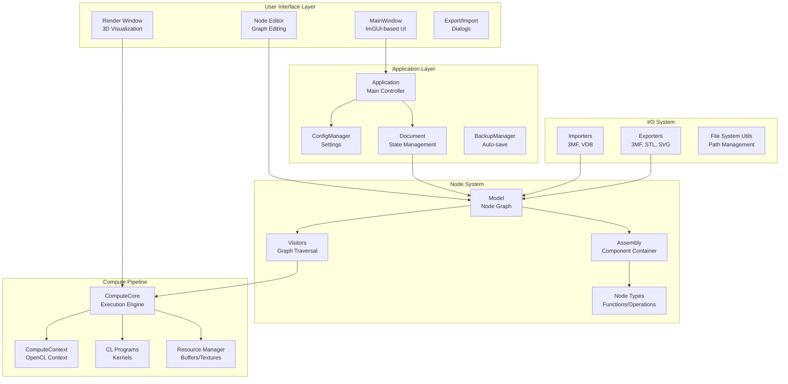
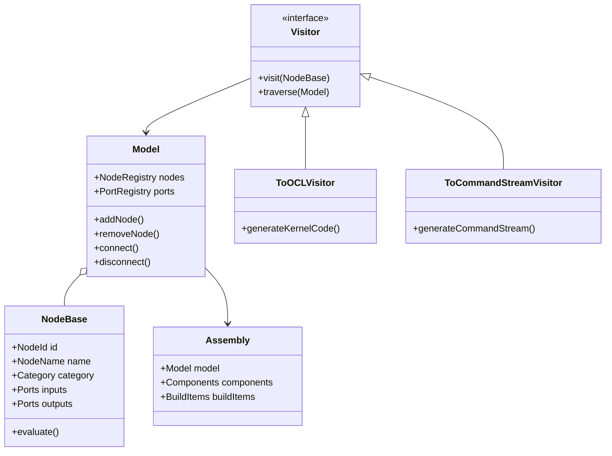
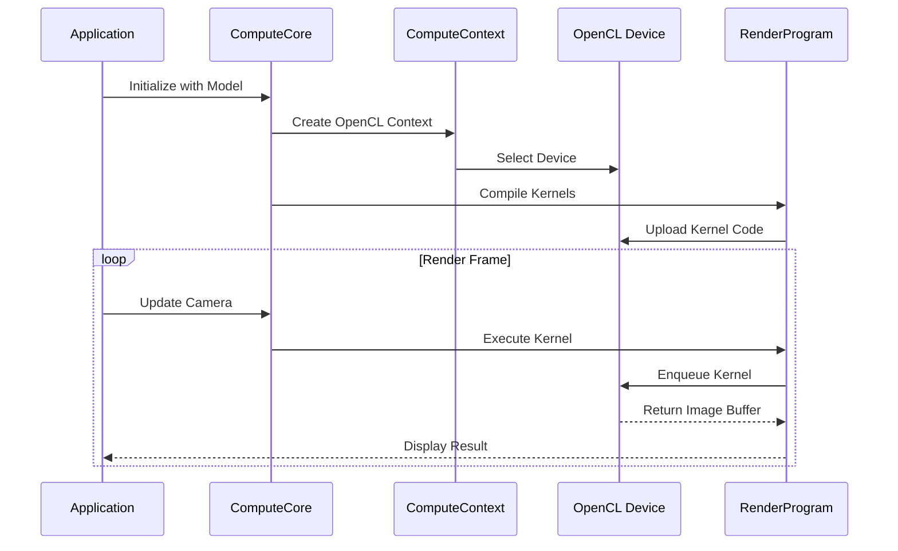
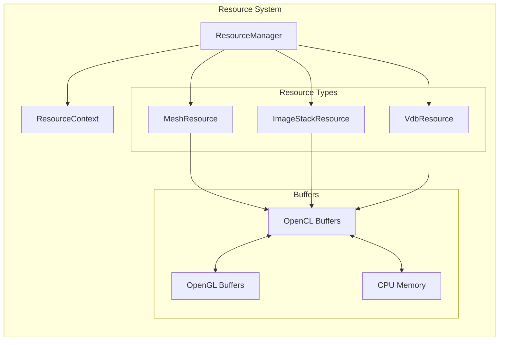
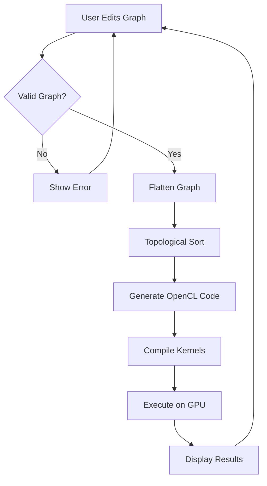
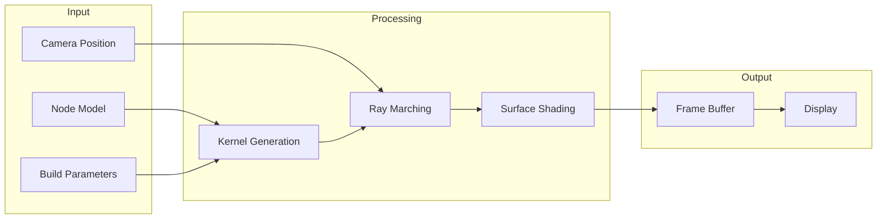
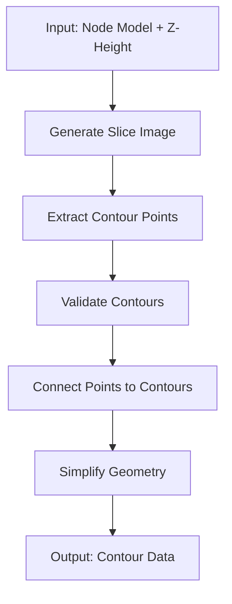

# Gladius Architecture Overview

## Introduction

Gladius is a development tool for processing implicit geometries, specifically designed as a playground for the 3MF Volumetric Extension. The software combines a graphical programming interface with a high-performance rendering engine to enable the design and visualization of complex 3D parts using Constructive Solid Geometry (CSG) principles.

## System Architecture



## Core Components

### 1. Application Layer

The application layer manages the overall lifecycle and provides coordination between major subsystems.

- **Application**: Main entry point that initializes the UI and configuration
- **ConfigManager**: Manages application settings and preferences
- **Document**: Maintains the current working document state
- **BackupManager**: Provides auto-save functionality for crash recovery

### 2. Node System

The node system implements a dataflow graph for defining implicit functions using CSG operations.



**Key Node Types:**
- **Begin/End**: Entry and exit points for function graphs
- **Primitives**: Basic shapes (sphere, box, cylinder, etc.)
- **Operations**: Boolean operations (union, intersection, difference)
- **Functions**: Mathematical functions (sin, cos, smoothstep, etc.)
- **Resources**: External data (meshes, images, VDB volumes)

### 3. Compute Pipeline

The compute pipeline uses OpenCL for GPU-accelerated evaluation of implicit functions.



**Key Components:**
- **ComputeCore**: Orchestrates compute operations and manages programs
- **ComputeContext**: Manages OpenCL context, devices, and command queues
- **RenderProgram**: Ray marching renderer for implicit surfaces
- **SlicerProgram**: Generates slices and contours at specified Z-heights
- **CLProgram**: Base class for OpenCL program management

### 4. Resource Management

Resources (meshes, images, VDB volumes) are managed centrally to enable sharing and efficient memory usage.



### 5. I/O System

The I/O system handles import and export of various file formats, with special focus on 3MF with volumetric extension.

**Import Formats:**
- 3MF with volumetric extension (implicit namespace and Image3D)
- OpenVDB volumes

**Export Formats:**
- 3MF with volumetric extension
- STL (mesh export)
- SVG (contour export)
- CLI (contour export)
- OpenVDB

### 6. User Interface

The UI is built with ImGUI and provides an immediate-mode interface for editing and visualization.

**Main Components:**
- **MainWindow**: Primary application window and menu system
- **NodeView**: Visual node graph editor with drag-and-drop
- **RenderWindow**: 3D viewport with orbital camera controls
- **SliceView**: 2D slice visualization and contour inspection
- **Various Dialogs**: Export configuration, settings, about dialog

## Data Flow

### Node Graph Execution Flow



### Rendering Pipeline



### Contour Extraction Pipeline



## Technology Stack

### Core Technologies
- **C++17/20**: Primary programming language
- **OpenCL 1.2+**: GPU compute acceleration
- **OpenGL 3.3+**: Graphics rendering
- **ImGUI**: Immediate-mode user interface

### Key Libraries
- **lib3mf**: 3MF file format support
- **OpenVDB**: Volumetric data structures
- **fmt**: String formatting
- **GTest/GMock**: Unit testing framework

### Build System
- **CMake**: Cross-platform build configuration
- **vcpkg**: Dependency management

## Design Patterns

### Visitor Pattern
Used extensively for traversing the node graph and generating different representations:
- `ToOCLVisitor`: Generates OpenCL kernel code
- `ToCommandStreamVisitor`: Generates command streams for evaluation

### Resource Acquisition Is Initialization (RAII)
All OpenCL and OpenGL resources use RAII for automatic cleanup:
- Smart pointers for memory management
- Scoped guards for state management

### Factory Pattern
Node creation uses factory functions for type-safe instantiation:
```cpp
NodeBase* createNodeFromName(const std::string& name, Model& nodes);
```

### Observer Pattern
Event logging system for propagating messages throughout the application:
```cpp
class EventLogger {
    void logInfo(const std::string& message);
    void logWarning(const std::string& message);
    void logError(const std::string& message);
};
```

## Threading Model

Gladius uses a single-threaded architecture with asynchronous GPU execution:

1. **Main Thread**: UI, event handling, graph editing
2. **OpenCL Command Queues**: Asynchronous GPU kernel execution
3. **Resource Loading**: May use background threads for large files

## Memory Management

### CPU Memory
- Smart pointers (`std::unique_ptr`, `std::shared_ptr`) for automatic cleanup
- RAII wrappers for system resources

### GPU Memory
- OpenCL buffers managed through RAII wrappers
- Shared memory between OpenCL and OpenGL via interop
- Resource pooling to minimize allocation overhead

## Performance Considerations

### Optimization Strategies
1. **GPU Acceleration**: All heavy computations run on OpenCL devices
2. **Lazy Evaluation**: Nodes only recompute when dependencies change
3. **Memory Pooling**: Resources are cached and reused when possible
4. **Incremental Updates**: UI updates only affected regions

### Bottlenecks
- Kernel compilation can be slow on first execution
- Large contour extraction on high-resolution slices
- File I/O for large 3MF files with embedded data

## Extensibility

### Adding New Node Types
1. Derive from `NodeBase` or use `ClonableNode<T>` template
2. Define input/output ports and parameters
3. Implement OpenCL kernel code generation
4. Register node type in node factory

### Adding New File Formats
1. Implement importer/exporter interface
2. Add to file dialog filters
3. Handle resource conversion

### Adding New UI Components
1. Create new dialog or view class
2. Integrate with MainWindow menu system
3. Use ImGUI immediate-mode API

## Security Considerations

- Input validation for all file formats
- Bounds checking in kernel code
- Safe string handling with modern C++ practices
- No unsafe casts or pointer arithmetic in user-facing code

## Future Directions

- Multi-GPU support for improved performance
- Network rendering for distributed computation
- Plugin system for third-party extensions
- Python scripting integration
- Advanced optimization passes for graph compilation

## Related Documentation

- [Node System Documentation](NODE_SYSTEM.md)
- [Compute Pipeline Documentation](COMPUTE_PIPELINE.md)
- [3MF Import/Export Documentation](3MF_SUPPORT.md)
- [API Reference](API_REFERENCE.md)
- [Developer Guide](DEVELOPER_GUIDE.md)
