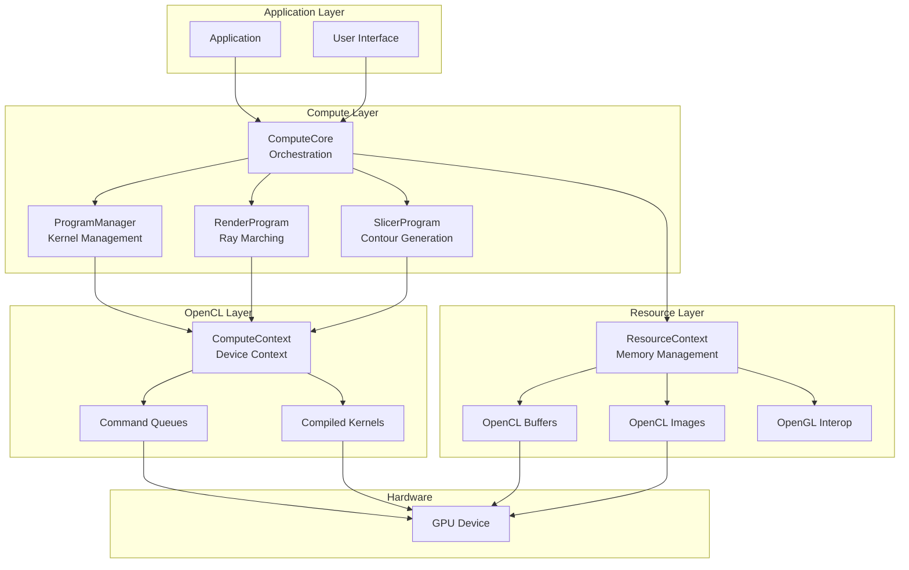
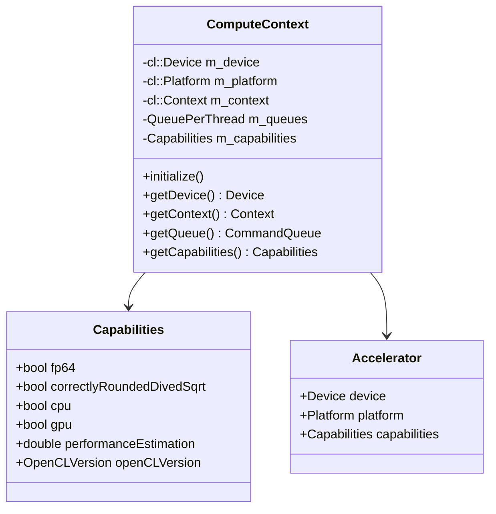
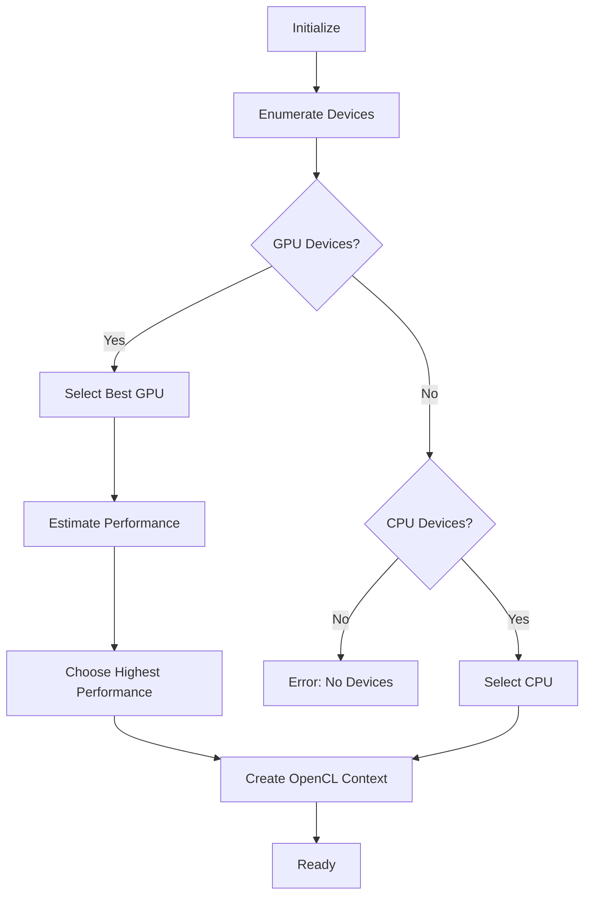
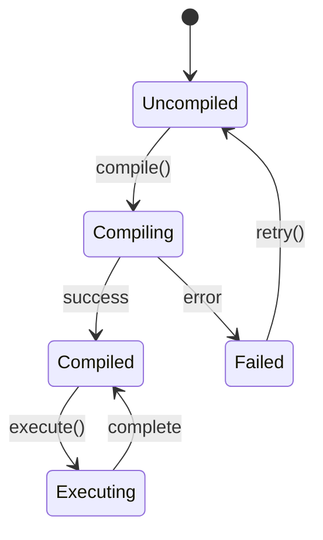
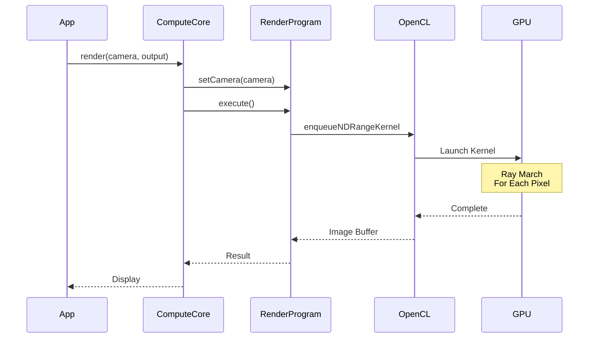
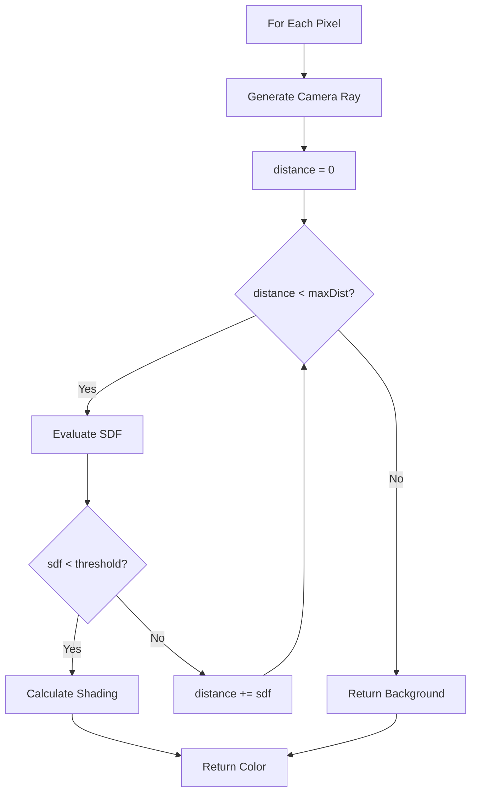
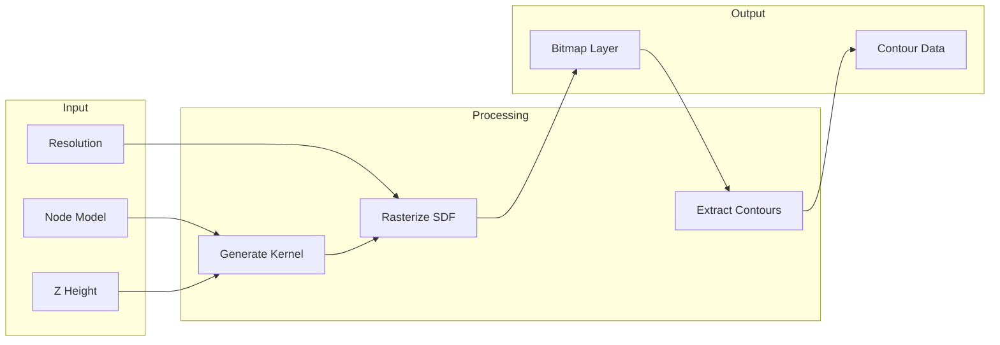
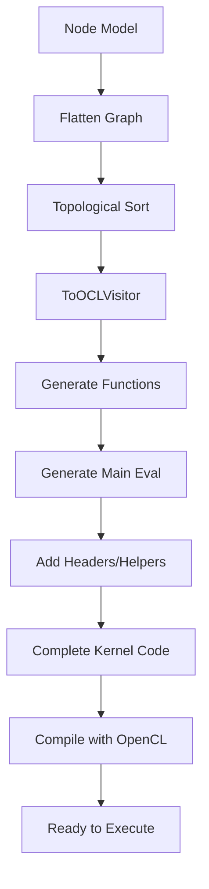
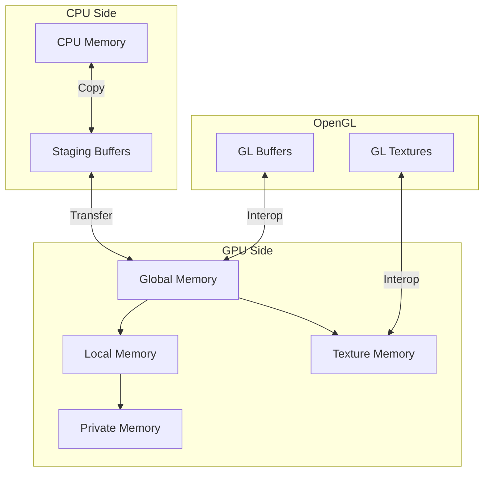
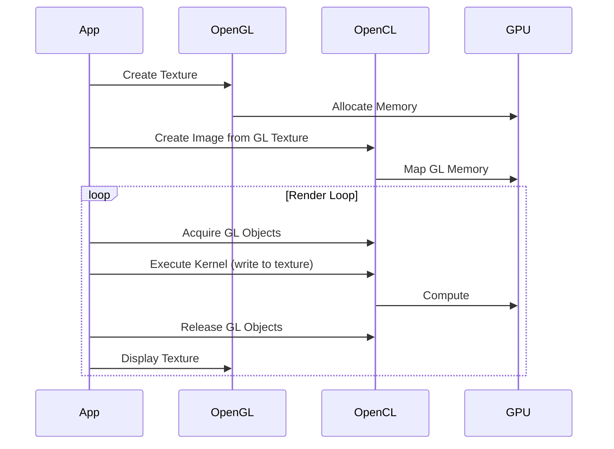

# Compute Pipeline Documentation

## Overview

The Compute Pipeline is the high-performance execution engine of Gladius, utilizing OpenCL for GPU-accelerated evaluation of implicit functions. The pipeline handles kernel compilation, resource management, and execution coordination between the CPU and GPU.

## Architecture



## Core Components

### ComputeContext

The `ComputeContext` manages the OpenCL environment, including device selection, context creation, and command queue management.



**Device Selection Strategy:**



**Key Features:**
- Automatic device selection based on performance estimation
- Multi-threaded command queue management (one queue per thread)
- Capability detection (FP64, CPU/GPU, OpenCL version)
- Fallback to CPU if no GPU available

### ComputeCore

The `ComputeCore` orchestrates all compute operations, managing the lifecycle of programs and coordinating execution.

```cpp
class ComputeCore {
public:
    ComputeCore(SharedComputeContext context, 
                SharedResourceContext resources);
    
    // Program management
    SharedRenderProgram getRenderProgram();
    SharedSlicerProgram getSlicerProgram();
    
    // Execution
    void updateModel(const nodes::Model& model);
    void render(const Camera& camera, ImageBuffer& output);
    void generateSlice(float zHeight, BitmapLayer& output);
    
private:
    SharedComputeContext m_context;
    SharedResourceContext m_resources;
    SharedProgramManager m_programManager;
};
```

**Responsibilities:**
- Initialize and manage compute programs
- Coordinate between different execution modes (render, slice, export)
- Handle model updates and kernel recompilation
- Manage resource allocation and cleanup

### ProgramManager

The `ProgramManager` handles compilation and caching of OpenCL programs.



**Features:**
- Incremental compilation (only recompile when source changes)
- Build error reporting with line numbers
- Kernel parameter caching
- Multi-kernel program support

## Execution Modes

### Rendering Pipeline

The rendering pipeline uses ray marching to visualize implicit surfaces in real-time.



**Ray Marching Algorithm:**



**Kernel Structure:**
```c
__kernel void render(
    __write_only image2d_t output,
    float16 camera,
    float4 viewport,
    // ... model parameters
) {
    int2 pixel = (int2)(get_global_id(0), get_global_id(1));
    
    // Generate ray
    float3 rayOrigin = camera.s012;
    float3 rayDir = calculateRayDirection(pixel, camera, viewport);
    
    // Ray march
    float dist = 0.0f;
    for (int i = 0; i < MAX_STEPS && dist < MAX_DIST; i++) {
        float3 pos = rayOrigin + rayDir * dist;
        float sdf = evaluateModel(pos);
        
        if (sdf < THRESHOLD) {
            // Hit surface - calculate shading
            float3 normal = calculateNormal(pos);
            float4 color = calculateShading(pos, normal, rayDir);
            write_imagef(output, pixel, color);
            return;
        }
        
        dist += sdf;
    }
    
    // No hit - background
    write_imagef(output, pixel, BACKGROUND_COLOR);
}
```

### Slicing Pipeline

The slicing pipeline generates 2D slices and contours at specified Z-heights.



**Slice Generation Kernel:**
```c
__kernel void generateSlice(
    __write_only image2d_t output,
    float zHeight,
    float2 bounds_min,
    float2 bounds_max
    // ... model parameters
) {
    int2 pixel = (int2)(get_global_id(0), get_global_id(1));
    int2 size = get_image_dim(output);
    
    // Calculate world position
    float2 uv = (float2)(pixel.x, pixel.y) / (float2)(size.x, size.y);
    float2 worldXY = mix(bounds_min, bounds_max, uv);
    float3 worldPos = (float3)(worldXY.x, worldXY.y, zHeight);
    
    // Evaluate SDF at this position
    float sdf = evaluateModel(worldPos);
    
    // Write distance value
    write_imagef(output, pixel, (float4)(sdf, 0, 0, 0));
}
```

## Kernel Generation

### From Node Graph to OpenCL Code

The system converts node graphs to executable OpenCL kernels using the Visitor pattern:



**Example Translation:**

Node Graph:
```
Begin → Sphere(radius=1.0) → Union → End
     → Box(size=0.5)       ↗
```

Generated OpenCL:
```c
// Helper function for sphere
float sdSphere(float3 p, float radius) {
    return length(p) - radius;
}

// Helper function for box
float sdBox(float3 p, float3 size) {
    float3 d = fabs(p) - size;
    return length(max(d, 0.0f)) + min(max(d.x, max(d.y, d.z)), 0.0f);
}

// Boolean operation
float opUnion(float a, float b) {
    return min(a, b);
}

// Main evaluation function
float evaluateModel(float3 p, float16 cs) {
    // Sphere evaluation
    float dist1 = sdSphere(p, 1.0f);
    
    // Box evaluation
    float dist2 = sdBox(p, (float3)(0.5f));
    
    // Union operation
    float result = opUnion(dist1, dist2);
    
    return result;
}
```

### Kernel Library

Pre-defined helper functions for common operations:

**SDF Primitives:**
- `sdSphere`, `sdBox`, `sdCylinder`, `sdTorus`, `sdCone`, `sdCapsule`, `sdPlane`

**Boolean Operations:**
- `opUnion`, `opIntersection`, `opDifference`
- `opSmoothUnion`, `opSmoothIntersection`, `opSmoothDifference`

**Domain Operations:**
- `opRepeat`, `opSymmetry`, `opDisplace`, `opTwist`, `opBend`

**Utility Functions:**
- `rotate`, `translate`, `scale`
- `calculateNormal` (gradient-based)
- `calculateAO` (ambient occlusion)

## Resource Management

### Memory Hierarchy



### Buffer Management

Buffers are allocated and managed through the `ResourceContext`:

```cpp
class ResourceContext {
public:
    // Buffer creation
    cl::Buffer createBuffer(size_t size, cl_mem_flags flags);
    cl::Image2D createImage2D(int width, int height, cl::ImageFormat format);
    cl::Image3D createImage3D(int width, int height, int depth, cl::ImageFormat format);
    
    // OpenGL interop
    cl::BufferGL createBufferGL(GLuint glBuffer, cl_mem_flags flags);
    cl::Image2DGL createImage2DGL(GLuint glTexture, cl_mem_flags flags);
    
    // Memory transfer
    void writeBuffer(cl::Buffer& buffer, const void* data, size_t size);
    void readBuffer(cl::Buffer& buffer, void* data, size_t size);
};
```

### OpenGL Interoperability

For efficient rendering, OpenCL can share memory with OpenGL:



**Synchronization:**
```cpp
// Acquire GL objects for OpenCL use
std::vector<cl::Memory> glObjects = {clImage};
queue.enqueueAcquireGLObjects(&glObjects);

// Execute OpenCL kernel
queue.enqueueNDRangeKernel(kernel, ...);

// Release back to OpenGL
queue.enqueueReleaseGLObjects(&glObjects);
queue.finish();

// Now OpenGL can render the result
```

## Performance Optimization

### Work Group Size Selection

Optimal work group size depends on the device:

```cpp
// Query device capabilities
size_t maxWorkGroupSize = device.getInfo<CL_DEVICE_MAX_WORK_GROUP_SIZE>();
size_t maxWorkItemDims[3];
device.getInfo(CL_DEVICE_MAX_WORK_ITEM_SIZES, &maxWorkItemDims);

// Choose appropriate size
cl::NDRange localSize(16, 16);  // 256 threads per work group
cl::NDRange globalSize(
    roundUp(width, 16),
    roundUp(height, 16)
);
```

### Memory Access Patterns

Optimizing for coalesced memory access:

```c
// BAD: Non-coalesced access
__kernel void bad_example(__global float* data) {
    int idx = get_global_id(0);
    float value = data[idx * 1000];  // Stride of 1000
}

// GOOD: Coalesced access
__kernel void good_example(__global float* data) {
    int idx = get_global_id(0);
    float value = data[idx];  // Consecutive access
}
```

### Local Memory Usage

Using local memory for shared data:

```c
__kernel void optimized_kernel(
    __global float* input,
    __global float* output,
    __local float* shared
) {
    int gid = get_global_id(0);
    int lid = get_local_id(0);
    
    // Load to local memory
    shared[lid] = input[gid];
    barrier(CLK_LOCAL_MEM_FENCE);
    
    // Compute using shared memory
    float result = 0.0f;
    for (int i = 0; i < get_local_size(0); i++) {
        result += shared[i];
    }
    
    output[gid] = result;
}
```

### Kernel Compilation Caching

Compiled binaries are cached to avoid recompilation:

```cpp
// Check cache
std::string cacheKey = computeHash(kernelSource);
if (m_kernelCache.contains(cacheKey)) {
    return m_kernelCache[cacheKey];
}

// Compile and cache
cl::Program program(context, kernelSource);
program.build(devices);
m_kernelCache[cacheKey] = program;
```

## Error Handling

### OpenCL Error Checking

All OpenCL calls are wrapped with error checking:

```cpp
#define CL_ERROR(X) gladius::checkError(X, LOCATION)

void checkError(cl_int err, const std::string& description) {
    if (err != CL_SUCCESS) {
        std::string errorName = getErrorString(err);
        throw ComputeException(
            fmt::format("OpenCL Error: {} at {}: {}",
                       errorName, description, err)
        );
    }
}
```

### Kernel Build Errors

Build errors are captured and reported with line numbers:

```cpp
try {
    program.build(devices);
} catch (cl::Error& e) {
    if (e.err() == CL_BUILD_PROGRAM_FAILURE) {
        std::string buildLog = program.getBuildInfo<CL_PROGRAM_BUILD_LOG>(device);
        throw ComputeException(
            fmt::format("Kernel compilation failed:\n{}", buildLog)
        );
    }
    throw;
}
```

## Profiling and Debugging

### Event-Based Profiling

OpenCL events can be used to measure kernel execution time:

```cpp
cl::Event event;
queue.enqueueNDRangeKernel(kernel, cl::NullRange, globalSize, localSize, nullptr, &event);
event.wait();

cl_ulong start = event.getProfilingInfo<CL_PROFILING_COMMAND_START>();
cl_ulong end = event.getProfilingInfo<CL_PROFILING_COMMAND_END>();
double duration = (end - start) * 1.0e-6;  // Convert to milliseconds
```

### Debugging Strategies

1. **CPU Fallback**: Test kernels on CPU with printf debugging
2. **Incremental Complexity**: Start simple and add features gradually
3. **Validation**: Compare GPU results with CPU reference implementation
4. **Bounds Checking**: Add assertions in kernels (development builds)

## Platform-Specific Considerations

### Windows

- Use NVIDIA/AMD/Intel OpenCL SDKs
- TDR (Timeout Detection and Recovery) can interrupt long-running kernels
- May need to adjust registry settings for longer kernel execution

### Linux

- OpenCL via Mesa or vendor drivers
- More relaxed kernel execution timeouts
- Better support for CPU fallback implementations

### Multi-GPU Systems

Currently uses default device, but can be extended:

```cpp
// Select specific GPU
std::vector<cl::Device> devices;
platform.getDevices(CL_DEVICE_TYPE_GPU, &devices);
cl::Device selectedDevice = devices[1];  // Choose second GPU
```

## Future Enhancements

- **Multi-GPU Rendering**: Split workload across multiple GPUs
- **Vulkan Compute**: Alternative to OpenCL for better performance
- **Persistent Kernels**: Keep kernels running for lower latency
- **Adaptive Work Size**: Dynamically adjust based on load
- **Advanced Caching**: Store compiled binaries on disk

## Related Documentation

- [Architecture Overview](ARCHITECTURE.md)
- [Node System Documentation](NODE_SYSTEM.md)
- [Resource Management](RESOURCE_MANAGEMENT.md)
- [Performance Tuning Guide](PERFORMANCE_TUNING.md)
