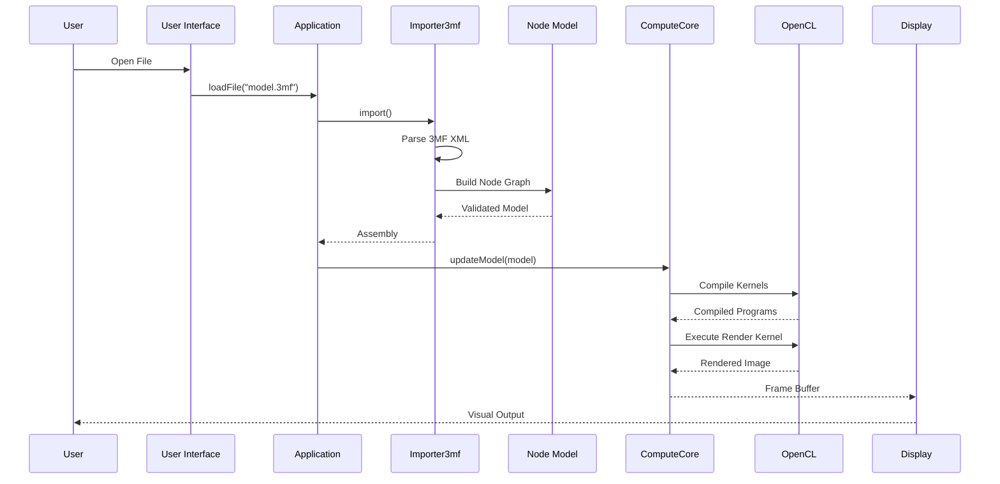
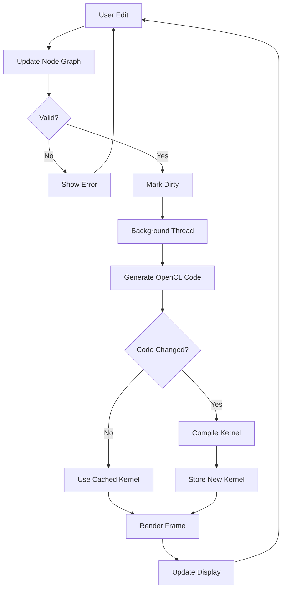
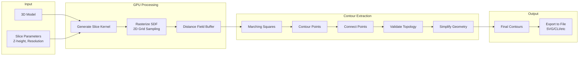
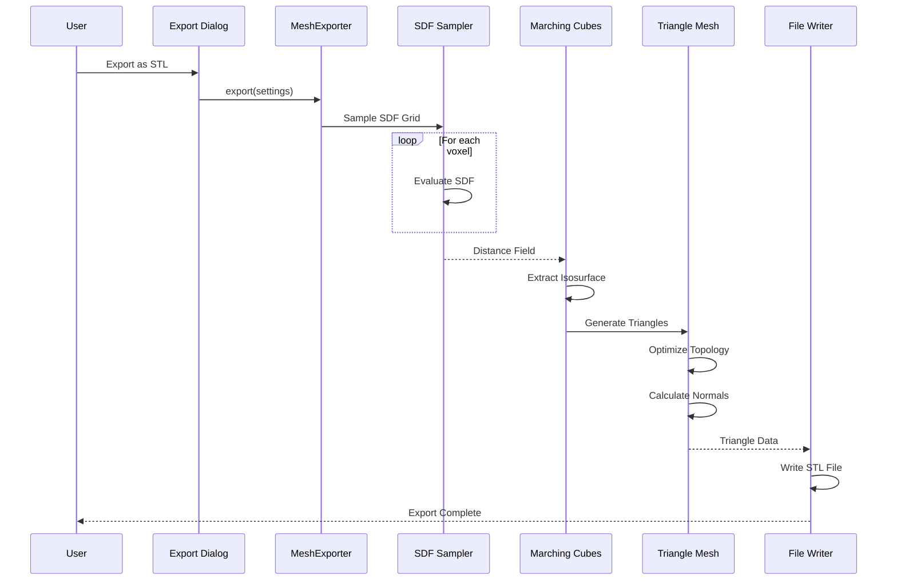
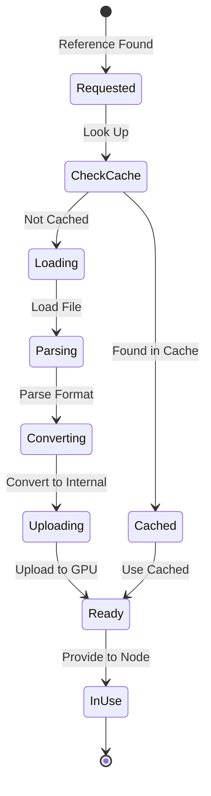
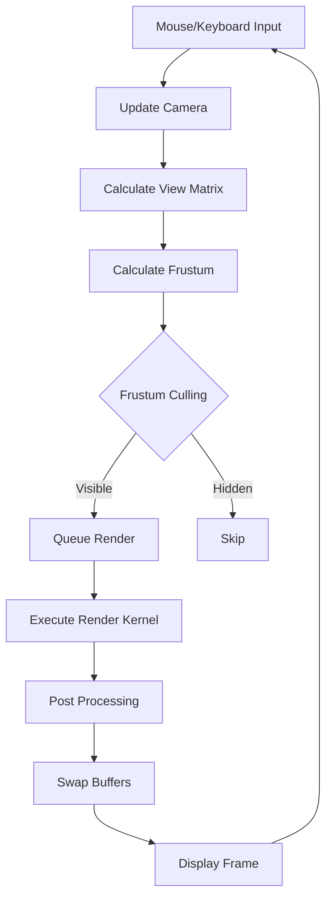
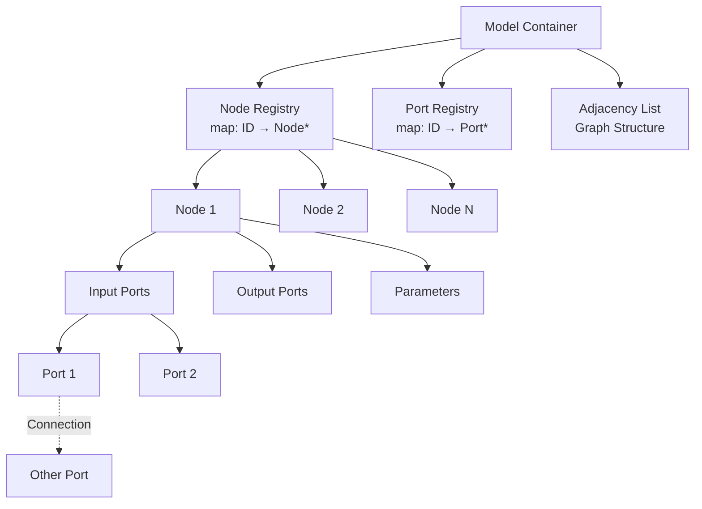
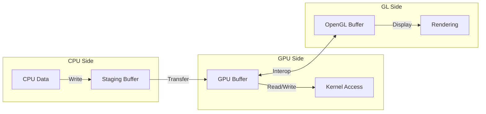
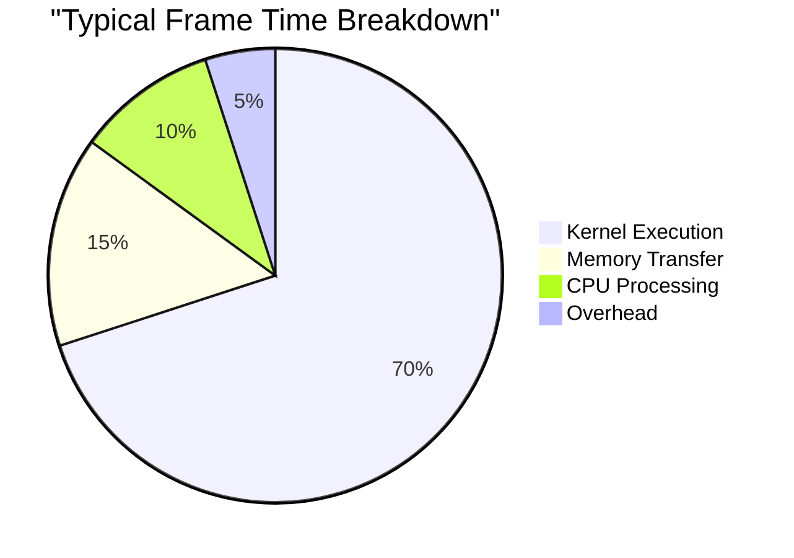

# Data Flow Documentation

## Overview

This document describes the major data flows through the Gladius system, from user input through processing to output. Understanding these flows is essential for debugging, optimization, and extending the system.

## Core Data Flows

### 1. Model Loading and Display

The complete flow from loading a 3MF file to rendering it on screen.



**Key Steps:**

1. **File Selection**: User selects 3MF file via file dialog
2. **XML Parsing**: lib3mf parses 3MF structure
3. **Graph Construction**: Nodes and connections created from XML
4. **Validation**: Graph checked for completeness and validity
5. **Kernel Generation**: OpenCL code generated from node graph
6. **Compilation**: Kernels compiled for target device
7. **Execution**: Rendering kernel executed on GPU
8. **Display**: Result shown in viewport

**Data Transformations:**

```
3MF XML → Node Graph → OpenCL Source → Compiled Kernel → Image Buffer → Screen
```

### 2. Interactive Editing Flow

How changes to the node graph propagate through the system.



**Optimization: Incremental Updates**

The system only recompiles when necessary:

1. **Change Detection**: Hash of node graph tracked
2. **Cache Lookup**: Check if kernel already compiled
3. **Selective Compilation**: Only compile if code changed
4. **Progressive Rendering**: Show preview while compiling

**Timing Example:**
- Node parameter change: ~1ms (no recompile)
- Add new node: ~50-200ms (recompile)
- Cached render: ~16ms (60 FPS)

### 3. Slicing Pipeline Flow

From 3D model to 2D contours for manufacturing.



**Detailed Steps:**

**Phase 1: GPU Rasterization**
```c
// For each pixel in slice
for (x, y in resolution) {
    worldPos = pixelToWorld(x, y, zHeight);
    distance = evaluateSDF(worldPos);
    buffer[x, y] = distance;
}
```

**Phase 2: Marching Squares**
```
For each grid cell:
    Check four corners
    Determine crossing configuration (0-15)
    Generate edge intersections
    Create line segments
```

**Phase 3: Contour Connection**
```
Start from any edge point:
    Follow to next connected point
    Continue until loop closes or boundary reached
    Mark visited points
Repeat for all unvisited points
```

**Phase 4: Simplification**
```
For each contour:
    Apply Douglas-Peucker algorithm
    Remove redundant points
    Maintain topology
```

### 4. Mesh Export Flow

Converting implicit geometry to explicit triangle mesh.



**Grid Sampling:**
```cpp
// Determine grid resolution
Vector3f bounds = getBoundingBox();
int resolution = 256;  // Voxels per axis

// Sample SDF
std::vector<float> grid(resolution * resolution * resolution);
for (int z = 0; z < resolution; z++) {
    for (int y = 0; y < resolution; y++) {
        for (int x = 0; x < resolution; x++) {
            Vector3f pos = gridToWorld(x, y, z);
            grid[index(x,y,z)] = evaluateSDF(pos);
        }
    }
}
```

**Marching Cubes:**
```
For each cube (8 voxels):
    1. Calculate cube index from corner signs
    2. Look up edge table
    3. Interpolate edge intersections
    4. Generate 0-5 triangles per cube
```

### 5. Resource Loading Flow

How external resources (meshes, images, VDB) are loaded and cached.



**Cache Management:**

```cpp
class ResourceCache {
    std::unordered_map<ResourceKey, ResourcePtr> m_cache;
    
public:
    ResourcePtr get(const ResourceKey& key) {
        // Check cache
        auto it = m_cache.find(key);
        if (it != m_cache.end()) {
            return it->second;  // Cache hit
        }
        
        // Load resource
        auto resource = loadResource(key);
        
        // Add to cache
        m_cache[key] = resource;
        
        return resource;
    }
};
```

**Resource Pipeline:**
```
File Path → File Load → Format Parse → Internal Representation → GPU Upload → Ready
```

### 6. Camera and View Updates

Real-time interaction and rendering updates.



**Frame Timing:**
```
Input (1ms) → Camera Update (0.5ms) → Render (14ms) → Display (0.5ms) = 16ms (60 FPS)
```

**Optimization: Dirty Flags**
```cpp
class Viewport {
    bool m_cameraDirty = true;
    bool m_modelDirty = true;
    
    void render() {
        if (!m_cameraDirty && !m_modelDirty) {
            return;  // No update needed
        }
        
        if (m_cameraDirty) {
            updateCameraUniforms();
            m_cameraDirty = false;
        }
        
        if (m_modelDirty) {
            recompileKernels();
            m_modelDirty = false;
        }
        
        executeRenderKernel();
    }
};
```

## Data Structures

### Node Graph Representation



### Buffer Management



**Memory Copy Patterns:**
```cpp
// CPU to GPU
void uploadData(const std::vector<float>& cpuData, cl::Buffer& gpuBuffer) {
    queue.enqueueWriteBuffer(gpuBuffer, CL_TRUE, 0, 
                            cpuData.size() * sizeof(float), 
                            cpuData.data());
}

// GPU to CPU
void downloadData(cl::Buffer& gpuBuffer, std::vector<float>& cpuData) {
    queue.enqueueReadBuffer(gpuBuffer, CL_TRUE, 0,
                           cpuData.size() * sizeof(float),
                           cpuData.data());
}

// GPU to GPU (fastest)
void copyBuffer(cl::Buffer& src, cl::Buffer& dst, size_t size) {
    queue.enqueueCopyBuffer(src, dst, 0, 0, size);
}
```

## Performance Characteristics

### Operation Timings (Typical)

| Operation | Time | Notes |
|-----------|------|-------|
| Parameter update | ~1ms | No recompile |
| Add/remove node | 50-200ms | Requires recompile |
| Render frame (GPU) | 5-16ms | Depends on complexity |
| Generate slice | 10-50ms | Depends on resolution |
| Extract contours | 20-100ms | Depends on complexity |
| Load 3MF file | 100-2000ms | Depends on file size |
| Export STL mesh | 500-5000ms | Depends on resolution |

### Memory Usage (Typical)

| Component | Memory | Notes |
|-----------|--------|-------|
| Node graph | 1-10 MB | Depends on complexity |
| Render buffer (1920x1080) | 8 MB | RGBA float |
| Slice buffer (4096x4096) | 16 MB | Single channel float |
| VDB resource | 10-500 MB | Depends on resolution |
| Compiled kernels | 1-5 MB | Cached binaries |

### Bottleneck Analysis



**Optimization Priorities:**
1. **Kernel Optimization**: 70% of time
   - Reduce operations per pixel
   - Optimize memory access patterns
   - Use local memory effectively

2. **Memory Transfer**: 15% of time
   - Use interop for GPU↔GPU transfers
   - Minimize CPU↔GPU transfers
   - Batch transfers when possible

3. **CPU Processing**: 10% of time
   - Cache expensive computations
   - Use parallel algorithms
   - Profile hot paths

## Debugging Data Flows

### Instrumentation Points

```cpp
// Add timing measurements
class ScopedTimer {
    std::string m_name;
    TimePoint m_start;
    
public:
    ScopedTimer(const std::string& name) 
        : m_name(name), m_start(Clock::now()) {}
    
    ~ScopedTimer() {
        auto duration = Clock::now() - m_start;
        log("Timer '{}': {} ms", m_name, duration.count());
    }
};

void renderFrame() {
    ScopedTimer timer("renderFrame");
    
    {
        ScopedTimer timer("updateCamera");
        updateCamera();
    }
    
    {
        ScopedTimer timer("executeKernel");
        executeKernel();
    }
}
```

### Data Validation

```cpp
// Validate intermediate results
void validateSliceData(const BitmapLayer& slice) {
    // Check for NaN/Inf
    for (const auto& value : slice.data()) {
        assert(std::isfinite(value));
    }
    
    // Check bounds
    auto [min, max] = std::minmax_element(
        slice.data().begin(), 
        slice.data().end()
    );
    assert(*min >= -1000.0f && *max <= 1000.0f);
}
```

### Logging Data Flow

```cpp
// Log major data flow events
EventLogger& log = EventLogger::instance();

log.info("Starting model import");
auto model = importer.import();
log.info("Model imported: {} nodes", model.getNodeCount());

log.info("Compiling kernels");
compiler.compile(model);
log.info("Compilation complete");

log.info("Executing render");
auto result = renderer.render(camera);
log.info("Render complete: {}x{}", result.width, result.height);
```

## Data Flow Optimization

### Lazy Evaluation

```cpp
class LazyResource {
    mutable std::optional<Data> m_cache;
    
public:
    const Data& get() const {
        if (!m_cache) {
            m_cache = loadData();  // Load on first access
        }
        return *m_cache;
    }
    
    void invalidate() {
        m_cache.reset();  // Clear cache
    }
};
```

### Asynchronous Loading

```cpp
class AsyncLoader {
    std::future<Resource> m_future;
    
public:
    void startLoad(const std::string& path) {
        m_future = std::async(std::launch::async, [path]() {
            return loadResource(path);
        });
    }
    
    bool isReady() const {
        return m_future.wait_for(0s) == std::future_status::ready;
    }
    
    Resource get() {
        return m_future.get();
    }
};
```

### Pipeline Parallelism

```
[Load File] → [Parse] → [Validate] → [Compile] → [Execute]
     ↓           ↓          ↓            ↓          ↓
   File 1     File 2    File 3       File 4     File 5
```

Multiple files can be in different pipeline stages simultaneously.

## Related Documentation

- [Architecture Overview](ARCHITECTURE.md)
- [Compute Pipeline](COMPUTE_PIPELINE.md)
- [Node System](NODE_SYSTEM.md)
- [Performance Tuning](PERFORMANCE_TUNING.md)
