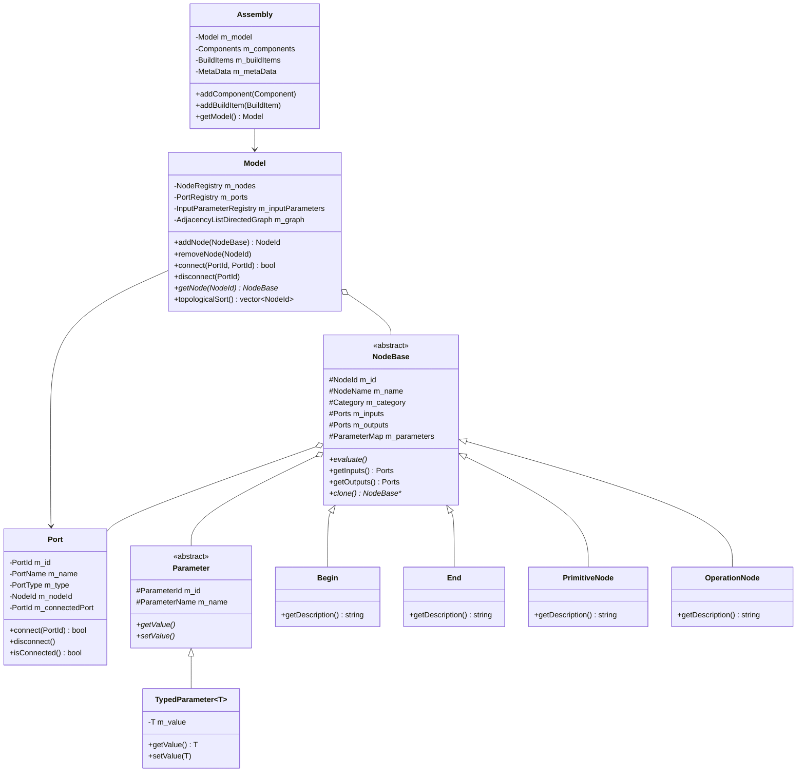
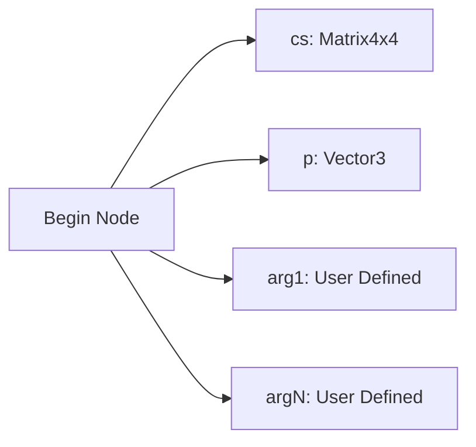
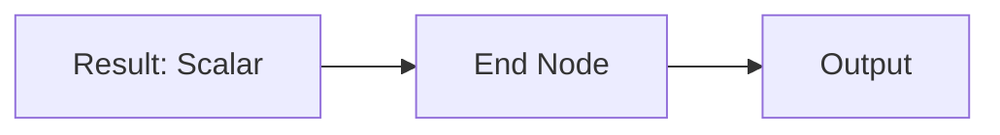
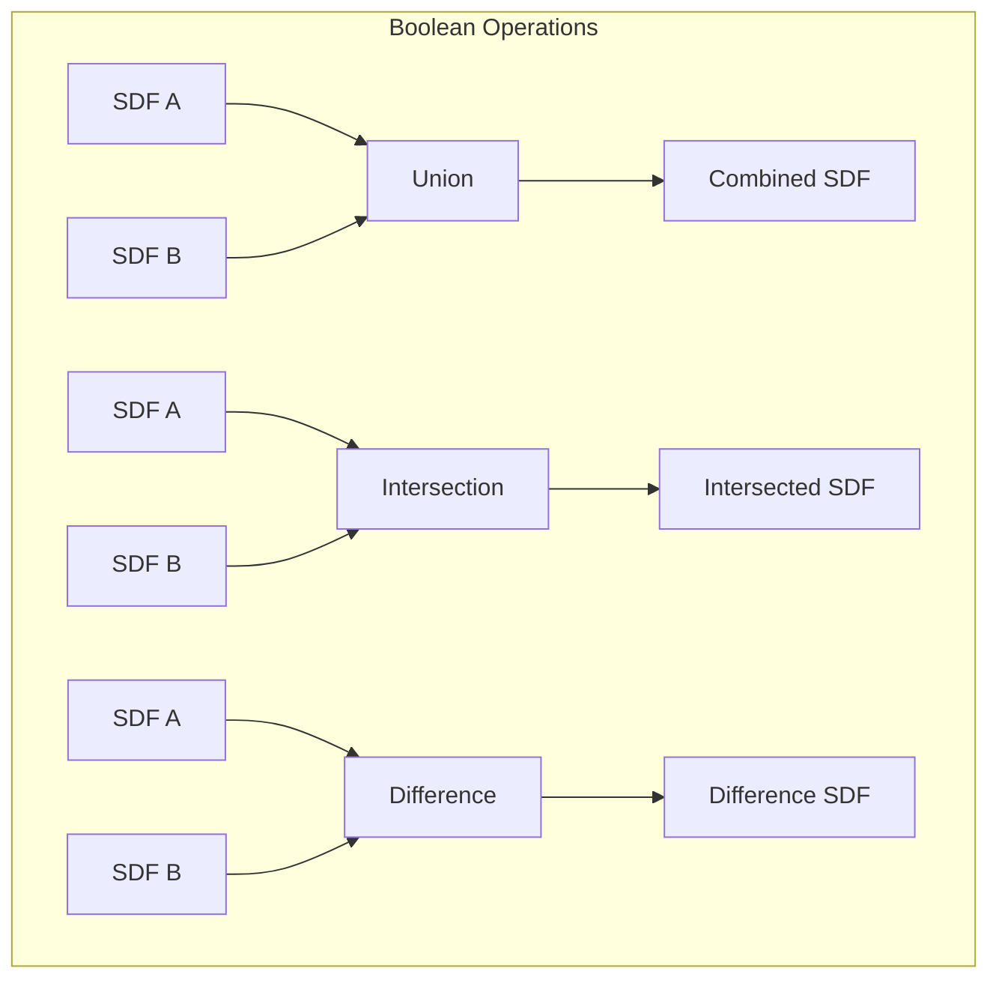
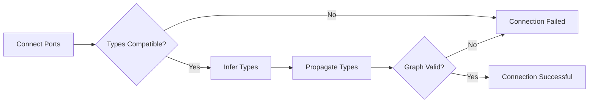
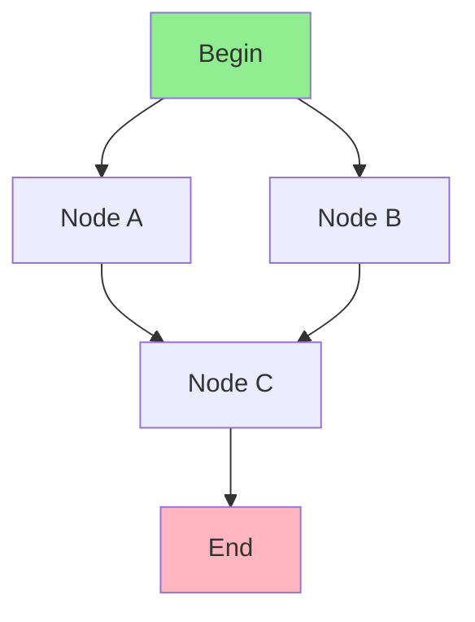
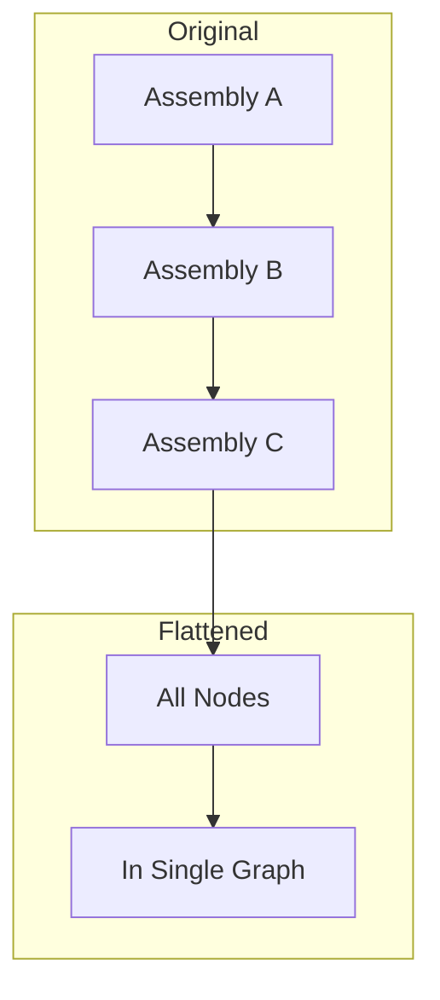
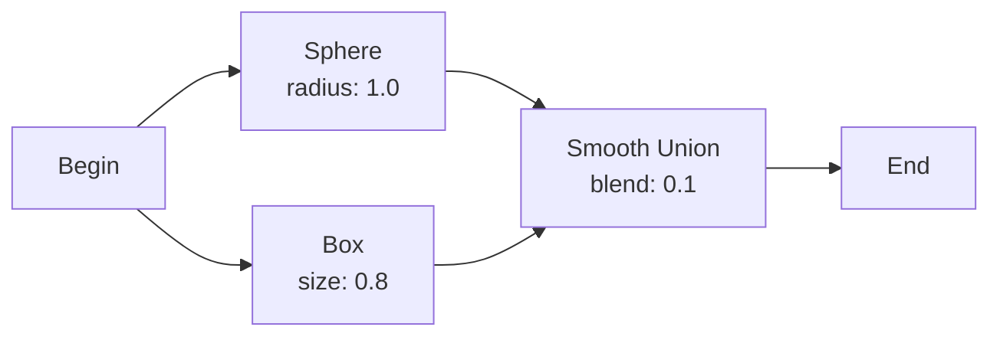
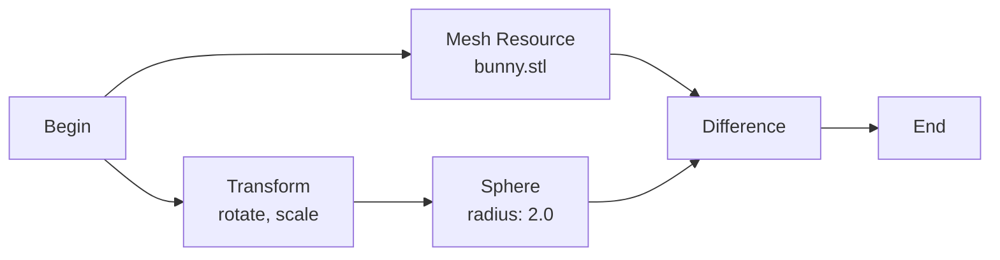

# Node System Documentation

## Overview

The Node System is the core of Gladius, implementing a dataflow graph architecture for defining implicit functions using Constructive Solid Geometry (CSG) operations. The system allows users to build complex 3D geometries by connecting nodes that represent primitives, operations, and mathematical functions.

## Architecture



## Core Classes

### Model

The `Model` class represents a complete node graph. It maintains:
- A registry of all nodes in the graph
- A registry of all ports for quick lookup
- An adjacency list representing connections between nodes
- Input parameters for the entire graph

**Key Methods:**
```cpp
// Node management
NodeId addNode(std::unique_ptr<NodeBase> node);
void removeNode(NodeId nodeId);
NodeBase* getNode(NodeId nodeId);

// Connection management
bool connect(PortId outputPort, PortId inputPort);
void disconnect(PortId port);

// Graph operations
std::vector<NodeId> topologicalSort() const;
bool isAcyclic() const;
std::vector<NodeId> getNodesInExecutionOrder() const;
```

### NodeBase

The abstract base class for all nodes. Every node has:
- **Unique ID**: For identification in the graph
- **Name**: Human-readable name
- **Category**: Classification (Primitive, Operation, Function, etc.)
- **Input Ports**: Connections to other nodes
- **Output Ports**: Connections to other nodes
- **Parameters**: Configuration values

**Node Categories:**
```cpp
enum class Category {
    Primitive,      // Basic shapes (sphere, box, cylinder)
    Operation,      // Boolean ops (union, intersection, difference)
    Function,       // Math functions (sin, cos, abs)
    Resource,       // External data (mesh, image, VDB)
    Internal,       // Begin/End nodes
    Utility,        // Helper nodes (constant, variable)
    Transform,      // Spatial transformations
    Material        // Surface properties
};
```

### Port

Ports define the inputs and outputs of nodes. Each port has:
- **Type**: Data type (Scalar, Vector3, Matrix4x4, etc.)
- **Direction**: Input or Output
- **Connection**: Reference to connected port (if any)

**Port Types:**
```cpp
enum class PortType {
    Scalar,         // Single floating-point value
    Vector2,        // 2D vector
    Vector3,        // 3D vector
    Vector4,        // 4D vector
    Matrix3x3,      // 3x3 transformation matrix
    Matrix4x4,      // 4x4 transformation matrix
    Resource,       // Resource reference
    Any             // Type to be inferred
};
```

### Parameter

Parameters are configurable values within nodes. They differ from ports in that they have fixed values set by the user, rather than connections to other nodes.

**Parameter Types:**
- `ScalarParameter`: Single floating-point value
- `Vector2Parameter`: 2D vector
- `Vector3Parameter`: 3D vector
- `BoolParameter`: Boolean value
- `IntParameter`: Integer value
- `StringParameter`: Text value
- `EnumParameter`: Selection from predefined options

## Node Types

### Begin Node

The Begin node is the entry point of a function graph. It provides:
- **cs (Coordinate System)**: The transformation matrix for the current evaluation
- **p (Position)**: The 3D point in space being evaluated
- **Additional Inputs**: User-defined function arguments



### End Node

The End node is the exit point of a function graph. It typically has:
- **Input**: The signed distance field value or composite result
- **Output**: The final function result



### Primitive Nodes

Primitive nodes generate signed distance fields for basic shapes.

**Available Primitives:**
- **Sphere**: Distance from sphere surface
- **Box**: Distance from box surface
- **Cylinder**: Distance from cylinder surface
- **Capsule**: Distance from capsule surface
- **Torus**: Distance from torus surface
- **Cone**: Distance from cone surface
- **Plane**: Distance from plane

**Example: Sphere Node**
```
Inputs:
  - cs: Matrix4x4 (coordinate system)
  - radius: Scalar (sphere radius)
Outputs:
  - distance: Scalar (signed distance)
```

### Operation Nodes

Operation nodes combine multiple signed distance fields using CSG operations.



**Boolean Operations:**
- **Union (min)**: Combines shapes (A ∪ B)
- **Intersection (max)**: Keeps only overlap (A ∩ B)
- **Difference**: Subtracts B from A (A - B)
- **Smooth Union**: Blended union with smooth transition
- **Smooth Intersection**: Blended intersection
- **Smooth Difference**: Blended subtraction

### Function Nodes

Function nodes perform mathematical operations on scalar, vector, or matrix values.

**Categories:**
1. **Arithmetic**: Add, Subtract, Multiply, Divide, Power
2. **Trigonometric**: Sin, Cos, Tan, Asin, Acos, Atan
3. **Comparison**: Less, Greater, Equal, Min, Max
4. **Vector Operations**: Dot, Cross, Normalize, Length
5. **Interpolation**: Mix, Smoothstep, Step, Clamp
6. **Noise**: Perlin, Simplex, Voronoi

### Resource Nodes

Resource nodes reference external data like meshes, images, or VDB volumes.

**Types:**
- **MeshResource**: Signed distance from mesh surface
- **ImageStackResource**: 3D texture sampling
- **VdbResource**: OpenVDB volume sampling

## Type System

The node system uses a flexible type system with automatic type inference and conversion.

### Type Rules

Each node defines type rules that determine output types based on input types:

```cpp
struct TypeRule {
    RuleType type;          // Default, Scalar, Vector, Matrix
    InputTypeMap input;     // Expected input types
    OutputTypeMap output;   // Resulting output types
};
```

### Type Inference

When nodes are connected, the system:
1. Checks if connection types are compatible
2. Applies type rules to determine output types
3. Propagates type changes through the graph
4. Validates that all connections are type-safe



## Graph Operations

### Topological Sort

The graph is topologically sorted to determine execution order:



Execution order: Begin → A, B → C → End

### Cycle Detection

The system validates that the graph is acyclic (no loops):

```cpp
bool Model::isAcyclic() const {
    return !m_graph.hasCycle();
}
```

### Graph Flattening

When assemblies reference other assemblies, the graph is flattened to a single level:



## Visitor Pattern

Visitors traverse the node graph to generate different representations:

### ToOCLVisitor

Generates OpenCL kernel code from the node graph:

```cpp
class ToOCLVisitor : public Visitor {
public:
    void visit(NodeBase& node) override;
    std::string getGeneratedCode() const;
};
```

**Generated Code Structure:**
```c
// Helper functions
float sdSphere(float3 p, float radius) { ... }
float opUnion(float a, float b) { ... }

// Main evaluation function
float evaluate(float3 p, float4x4 cs) {
    // Node evaluation in topological order
    float dist1 = sdSphere(p, 1.0f);
    float dist2 = sdBox(p, (float3)(0.5f));
    float result = opUnion(dist1, dist2);
    return result;
}
```

### ToCommandStreamVisitor

Generates a command stream for CPU evaluation:

```cpp
class ToCommandStreamVisitor : public Visitor {
public:
    void visit(NodeBase& node) override;
    CommandStream getCommandStream() const;
};
```

## Example Workflows

### Creating a Simple CSG Object



**Steps:**
1. Create Begin and End nodes
2. Add Sphere primitive with radius 1.0
3. Add Box primitive with size 0.8
4. Add Smooth Union operation
5. Connect: Begin → Sphere → Union → End
6. Connect: Begin → Box → Union

### Using Resources



## Performance Considerations

### Optimization Strategies

1. **Node Caching**: Results are cached when inputs haven't changed
2. **Dead Code Elimination**: Unused nodes are not evaluated
3. **Constant Folding**: Compile-time evaluation of constant expressions
4. **Common Subexpression Elimination**: Shared computations are reused

### Best Practices

- Keep graphs shallow when possible (fewer levels)
- Use smooth operations sparingly (more expensive)
- Avoid unnecessary coordinate transformations
- Minimize resource node usage in tight loops

## Serialization

Nodes can be serialized to 3MF format using the implicit namespace:

```xml
<model xmlns="http://schemas.microsoft.com/3dmanufacturing/core/2015/02">
  <resources>
    <object id="1" type="model">
      <mesh>
        <implicitfunction>
          <node id="1" type="begin"/>
          <node id="2" type="sphere">
            <input name="cs" source="1:cs"/>
            <param name="radius">1.0</param>
          </node>
          <node id="3" type="end">
            <input name="result" source="2:distance"/>
          </node>
        </implicitfunction>
      </mesh>
    </object>
  </resources>
</model>
```

## Error Handling

The node system validates graphs and reports errors:

- **Type Mismatch**: Connecting incompatible port types
- **Cyclic Graph**: Loops in the graph
- **Missing Connections**: Required inputs not connected
- **Invalid Parameters**: Out-of-range parameter values
- **Missing Resources**: Referenced files not found

## Extension Points

### Creating Custom Nodes

```cpp
class CustomNode : public ClonableNode<CustomNode> {
public:
    CustomNode() : ClonableNode("CustomNode", {}, Category::Function) {
        // Define ports
        addInput("input", PortType::Scalar);
        addOutput("output", PortType::Scalar);
        
        // Define parameters
        addParameter("factor", 1.0f);
    }
    
    std::string getDescription() const override {
        return "Custom node description";
    }
    
    // OpenCL code generation
    std::string generateKernelCode() const override {
        return "output = input * factor;";
    }
};
```

### Registering Custom Nodes

```cpp
// In node factory
NodeBase* createNodeFromName(const std::string& name, Model& model) {
    if (name == "CustomNode") {
        return new CustomNode();
    }
    // ... other nodes
}
```

## Related Documentation

- [Architecture Overview](ARCHITECTURE.md)
- [Compute Pipeline Documentation](COMPUTE_PIPELINE.md)
- [Graph Algorithms](GRAPH_ALGORITHMS.md)
- [API Reference](API_REFERENCE.md)
