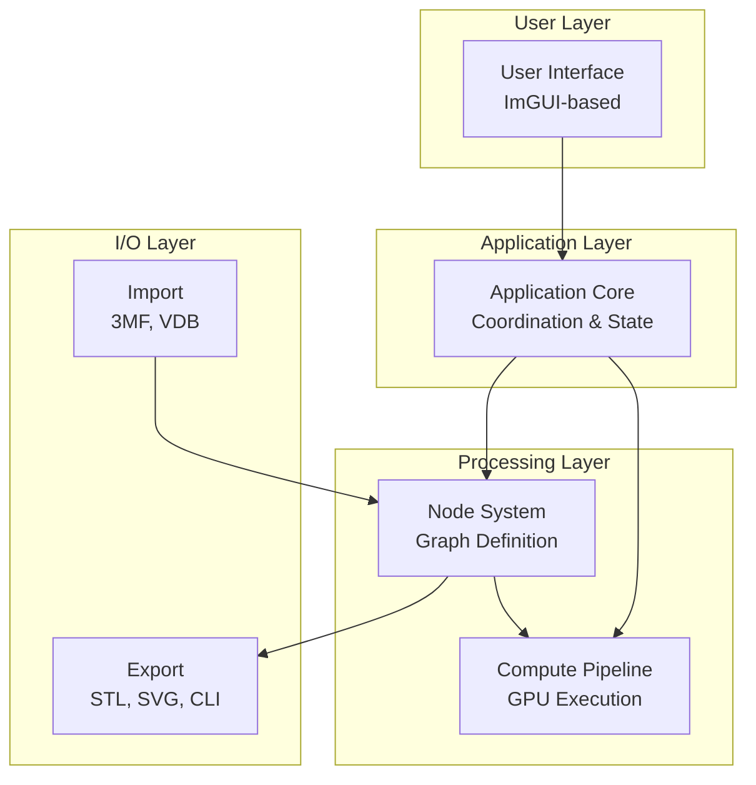

# Gladius Documentation

Welcome to the comprehensive documentation for Gladius - a development tool for processing implicit geometries with the 3MF Volumetric Extension.

## 📚 Documentation Index

### Getting Started

- **[Developer Guide](DEVELOPER_GUIDE.md)** - Start here! Complete guide to setting up your development environment, building, and contributing
- **[Architecture Overview](ARCHITECTURE.md)** - High-level system architecture and component overview
- **[Quick Reference](QUICK_REFERENCE.md)** - Handy reference for common tasks and APIs

### Core Systems

- **[Node System](NODE_SYSTEM.md)** - Detailed documentation of the node graph system
  - Node types and categories
  - Type system and validation
  - Graph operations and visitors
  - Creating custom nodes

- **[Compute Pipeline](COMPUTE_PIPELINE.md)** - GPU acceleration and OpenCL execution
  - ComputeContext and device management
  - Kernel generation and compilation
  - Rendering and slicing pipelines
  - Performance optimization

- **[Data Flow](DATA_FLOW.md)** - How data moves through the system
  - Model loading and display
  - Interactive editing
  - Slicing and export workflows
  - Performance characteristics

### Integration and I/O

- **[3MF Support](3MF_SUPPORT.md)** - Import/Export of 3MF with Volumetric Extension
  - Implicit function graphs
  - Image3D volumetric data
  - Resource management
  - Format compatibility

- **[API Reference](API_REFERENCE.md)** - Public API for C++, C#, and Python
  - Class hierarchy
  - Method documentation
  - Usage examples
  - Language bindings

## 🎯 Documentation by Use Case

### I want to...

#### Use Gladius in My Application
→ Start with [API Reference](API_REFERENCE.md) for programmatic access

#### Add a New Feature
→ Read [Developer Guide](DEVELOPER_GUIDE.md) → [Architecture Overview](ARCHITECTURE.md) → relevant system doc

#### Fix a Bug
→ Check [Data Flow](DATA_FLOW.md) to understand the code path → [Developer Guide](DEVELOPER_GUIDE.md) for debugging

#### Add a New Node Type
→ See "Adding New Node Types" in [Node System](NODE_SYSTEM.md) → [Developer Guide](DEVELOPER_GUIDE.md)

#### Optimize Performance
→ Review performance sections in [Compute Pipeline](COMPUTE_PIPELINE.md) and [Data Flow](DATA_FLOW.md)

#### Support a New File Format
→ Study [3MF Support](3MF_SUPPORT.md) as a reference → implement similar patterns

#### Understand How Something Works
→ Start with [Architecture Overview](ARCHITECTURE.md) → dive into specific system docs

## 🗺️ System Overview

## 🔑 Key Concepts

### Implicit Geometry
Gladius uses signed distance fields (SDFs) to represent 3D geometry implicitly as mathematical functions rather than explicit meshes. This enables:
- Exact CSG operations
- Infinite resolution
- Compact representation
- Efficient ray marching

### Node Graphs
Complex shapes are built by connecting nodes in a dataflow graph:
- **Primitive nodes**: Basic shapes (sphere, box, cylinder)
- **Operation nodes**: Combine shapes (union, intersection, difference)
- **Function nodes**: Mathematical transformations
- **Resource nodes**: External data (meshes, images, volumes)

### GPU Acceleration
All heavy computations run on the GPU via OpenCL:
- Real-time rendering using ray marching
- Fast slice generation for manufacturing
- Parallel contour extraction

### 3MF Volumetric Extension
Native support for the 3MF format with implicit geometry:
- Import/export function graphs
- Embed volumetric data
- Preserve design intent

## 📖 Documentation Structure

Each documentation file follows a consistent structure:

1. **Overview** - What the system does and why it exists
2. **Architecture** - High-level design with diagrams
3. **Core Components** - Detailed class and interface documentation
4. **Usage Examples** - Practical code examples
5. **Common Patterns** - Best practices and idioms
6. **Troubleshooting** - Common issues and solutions
7. **Related Documentation** - Links to related topics

## 🎨 Diagram Legend

Throughout the documentation, you'll find Mermaid diagrams with these conventions:

- **Rectangles**: Components or classes
- **Rounded rectangles**: Processes or operations
- **Diamonds**: Decisions or conditions
- **Cylinders**: Data storage
- **Arrows**: Data flow or dependencies
- **Colors**: 
  - Green: Entry points
  - Blue: Core components
  - Orange: External systems
  - Red: Error states

## 🔧 Tools Used

- **Language**: C++17/20
- **GPU Compute**: OpenCL 1.2+
- **Graphics**: OpenGL 3.3+
- **UI Framework**: Dear ImGUI
- **Build System**: CMake + vcpkg
- **Testing**: Google Test / Google Mock
- **File Format**: 3MF (lib3mf), OpenVDB

## 🤝 Contributing to Documentation

Documentation improvements are always welcome! When contributing:

1. **Follow the structure** - Match the existing format
2. **Add diagrams** - Use Mermaid for visual explanations
3. **Include examples** - Code samples help understanding
4. **Cross-reference** - Link to related documentation
5. **Test code** - Ensure examples actually work
6. **Update index** - Add new documents to this README

## 📝 Documentation Standards

- Use GitHub-flavored Markdown
- Include Mermaid diagrams for complex concepts
- Provide code examples in C++ (primary language)
- Keep paragraphs concise and scannable
- Use tables for reference information
- Include links to related sections

## 🚀 Quick Start Path

**New Developer? Follow this path:**

1. [Developer Guide](DEVELOPER_GUIDE.md) - Set up environment and build
2. [Architecture Overview](ARCHITECTURE.md) - Understand the big picture
3. [Node System](NODE_SYSTEM.md) - Learn the core abstraction
4. [Quick Reference](QUICK_REFERENCE.md) - Bookmark for daily use
5. Pick a specific topic based on your work

**New User of the API? Follow this path:**

1. [API Reference](API_REFERENCE.md) - Learn the public interface
2. [3MF Support](3MF_SUPPORT.md) - Understand the file format
3. [Quick Reference](QUICK_REFERENCE.md) - Common API patterns
4. Start coding!

## 🔍 Finding Information

- **Search by topic**: Use GitHub's file search (`Ctrl+K` or `Cmd+K`)
- **Search within file**: Use your editor's search (`Ctrl+F`)
- **Browse code**: Links to source files are provided where relevant
- **Check examples**: Many docs include working code examples

## 💡 Tips for Reading

- Diagrams are clickable - you can zoom and inspect
- Code blocks are syntax highlighted
- Links are blue and underlined
- Important notes are in **bold** or > blockquotes
- Examples show multiple languages where applicable

## 📦 Additional Resources

### External Documentation
- [3MF Specification](https://3mf.io/specification/)
- [OpenCL Documentation](https://www.khronos.org/opencl/)
- [ImGUI Documentation](https://github.com/ocornut/imgui)
- [CMake Documentation](https://cmake.org/documentation/)

### Community
- [GitHub Repository](https://github.com/3MFConsortium/gladius)
- [Issue Tracker](https://github.com/3MFConsortium/gladius/issues)
- [Discussions](https://github.com/3MFConsortium/gladius/discussions)

## 📅 Documentation Versions

This documentation corresponds to Gladius version 1.2.0 and above. If you're using an older version, some features may not be available.

## ❓ Questions?

- **Found an error?** Open an issue on GitHub
- **Need clarification?** Start a discussion
- **Want to contribute?** Submit a pull request

## 🏆 Credits

Documentation created and maintained by the Gladius development team and community contributors.

---

**Last Updated**: December 2024  
**Documentation Version**: 1.0  
**Gladius Version**: 1.2.0+
