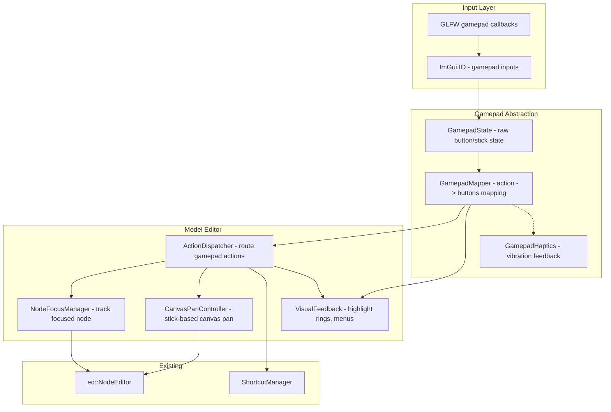

# Gamepad Support for Model Editor - Plan

## Current State Analysis

### Existing Input Infrastructure
- **ImGui gamepad flags** are already enabled in [`GLView.cpp`](gladius/src/ui/GLView.cpp:315):
  ```cpp
  io.ConfigFlags |= ImGuiConfigFlags_NavEnableKeyboard | ImGuiConfigFlags_NavEnableGamepad;
  ```
- **Shortcut system** exists in [`ShortcutManager`](gladius/src/ui/ShortcutManager.h:126) with contexts: `Global`, `RenderWindow`, `ModelEditor`, `SlicePreview`
- **Keyboard shortcuts** are defined in [`ShortcutDefinitions.h`](gladius/src/ui/ShortcutDefinitions.h:58) for model editor operations (undo, redo, compile, copy, paste, delete, auto-layout, new node, navigate back/forward)
- **Node editor** (`imguinodeeditor`) provides `ed::NavigateToContent()`, `ed::NavigateToSelection()`, `ed::SelectNode()`, `ed::GetHoveredNode()`

### What's Missing
- No gamepad-specific input mapping or handling
- Shortcut system only maps keyboard keys (`ImGuiKey`), not gamepad actions
- Node selection/navigation in the graph is mouse/keyboard-only
- No visual feedback for gamepad interaction (no cursor highlight ring, no focus indicators)
- The model editor has no awareness of gamepad state

## Goals

1. **Full gamepad navigation** through the node editor: move focus between nodes, select/deselect, pan around the canvas
2. **Gamepad-accessible actions**: undo, redo, compile, copy, paste, delete, auto-layout, create node, extract function
3. **Visual feedback**: clear visual indicators for gamepad focus (node hover ring, menu item highlighting)
4. **Configurable bindings**: allow users to customize gamepad button mappings via settings dialog
5. **Context-aware**: gamepad controls only active when model editor is focused/visible

## Architecture Overview



## Detailed Plan

### Phase 1: Gamepad State Abstraction

**File**: `gladius/src/ui/GamepadState.h` / `gladius/src/ui/GamepadState.cpp`

Track raw gamepad input state across frames:
- Store which gamepads are connected (GLFW gamepad polling)
- Expose button states (A/X, B/Circle, Y, X/Square, LB/RB, LT/RT triggers, LSticks, RSticks, D-pad)
- Deadzone handling for analog sticks
- Frame-based input detection (pressed this frame, released this frame, held)

Key methods:
```cpp
class GamepadState {
public:
    struct GamepadInfo {
        int instance_id;
        std::string name;
        bool connected;
    };
    
    static GamepadState & instance();
    std::vector<GamepadInfo> connectedGamepads() const;
    bool isAnyConnected() const;
    
    // Button queries (first connected gamepad)
    bool isButtonPressed(GamepadButton button) const;
    bool isButtonReleased(GamepadButton button) const;
    bool isButtonHeld(GamepadButton button, float holdThreshold) const;
    ImVec2 getLeftStick() const;      // -1 to 1, normalized
    ImVec2 getRightStick() const;     // -1 to 1, normalized
    float getLeftTrigger() const;     // 0 to 1
    float getRightTrigger() const;    // 0 to 1
    
    void update();  // Call once per frame
};

enum class GamepadButton {
    A, B, X, Y,
    LB, RB,  // Shoulder buttons
    LStick, RStick,  // Stick clicks
    Back, Forward,  // Start/Select
    DPadUp, DPadDown, DPadLeft, DPadRight,
    Count
};
```

### Phase 2: Action Mapping System

**File**: `gladius/src/ui/GamepadActionMap.h` / `gladius/src/ui/GamepadActionMap.cpp`

Define gamepad actions that map to editor operations:
```cpp
enum class GamepadAction {
    // Navigation
    NavigateUp,      // Move focus up in node list / D-pad up
    NavigateDown,    // Move focus down / D-pad down  
    NavigateLeft,    // Move focus left / D-pad left
    NavigateRight,   // Move focus right / D-pad right
    
    // Canvas navigation
    PanCanvasLeft,   // Stick-based canvas panning
    PanCanvasRight,
    PanCanvasUp,
    PanCanvasDown,
    
    // Selection
    Select,          // A/X button - select node
    Deselect,        // B/Circle - deselect or go back
    ToggleSelect,    // X/Square - toggle selection
    
    // Actions
    Confirm,         // Same as Select but for menu confirmation
    Cancel,          // Same as Deselect but for closing menus
    
    // Editor actions
    Undo,
    Redo,
    Compile,
    Copy,
    Paste,
    Delete,
    AutoLayout,
    CreateNode,
    ExtractFunction,
    CenterView,
    
    // Menu navigation
    OpenMenu,        // Y button - open context menu / create node menu
    NavigateBack,    // Navigate to previous function
    NavigateForward, // Navigate to next function
    
    Count
};
```

Default binding scheme (Xbox-style):
```
| Action              | Default Binding          |
|---------------------|--------------------------|
| Navigate Up         | D-Pad Up                |
| Navigate Down       | D-Pad Down              |
| Navigate Left       | D-Pad Left              |
| Navigate Right      | D-Pad Right             |
| Select/Confirm      | A (Bottom)              |
| Cancel/Deselect     | B (Right)               |
| Toggle Select       | X (Left)                |
| Open Menu           | Y (Top)                 |
| Pan Canvas          | Left Stick              |
| Zoom                | Right Stick (press)     |
| Undo                | LB + A                  |
| Redo                | RB + A                  |
| Compile             | RB + Y                  |
| Copy                | LB + X                  |
| Paste               | RB + X                  |
| Delete              | LB + B                  |
| Auto Layout         | RB + DPad Down          |
| Create Node         | Y (hold) or LB + Y      |
| Center View         | Right Stick press       |
| Navigate Back       | Left Stick press + A    |
| Navigate Forward    | Left Stick press + Y    |
```

### Phase 3: Node Focus Manager

**File**: `gladius/src/ui/NodeFocusManager.h` / `gladius/src/ui/NodeFocusManager.cpp`

Track and manage which node has keyboard/gamepad focus:
```cpp
class NodeFocusManager {
public:
    // Get all visible nodes in current editor
    std::vector<nodes::NodeId> visibleNodes() const;
    
    // Set/get focused node
    void setFocusedNode(nodes::NodeId nodeId);
    [[nodiscard]] nodes::NodeId focusedNode() const;
    [[nodiscard]] bool hasFocus() const;
    
    // Navigate focus (cycle through nodes)
    void navigateFocus(NavigationDirection dir);  // Up, Down, Left, Right
    
    // Selection management
    void selectNode(nodes::NodeId nodeId, bool additive = false);
    void deselectNode(nodes::NodeId nodeId);
    void clearSelection();
    [[nodiscard]] std::vector<nodes::NodeId> selectedNodes() const;
    
    // Spatial awareness for navigation
    void updateNodePositions();  // Called after node positions change
    
private:
    nodes::NodeId m_focusedNode{0};
    std::vector<nodes::NodeId> m_selection;
    
    // Spatial index for directional navigation
    struct NodePosition {
        nodes::NodeId id;
        ImVec2 center;
    };
    std::vector<NodePosition> m_nodePositions;
    
    nodes::NodeId nearestNodeInDirection(nodes::NodeId from, NavigationDirection dir) const;
};
```

Integration with existing node editor:
- On `Select` action → call `ed::SelectNode()` and `ed::NavigateToSelection()`
- On `Delete` action → call existing delete logic with focused node
- On `Copy` action → call existing copy with focused node selected

### Phase 4: Canvas Pan Controller

**File**: `gladius/src/ui/CanvasPanController.h` / `gladius/src/ui/CanvasPanController.cpp`

Handle analog stick-based canvas panning:
```cpp
class CanvasPanController {
public:
    void update(GamepadState & gamepad, float deltaTime);
    
    // Apply pan offset to node editor
    void applyPan();
    
    // Zoom via right stick or triggers
    void updateZoom(GamepadState & gamepad);
    float zoomLevel() const;
    
private:
    ImVec2 m_panOffset{0, 0};
    float m_zoomLevel{1.0f};
    float m_deadzone{0.25f};
    float m_panSpeed{200.0f};
    float m_zoomSpeed{0.5f};
};
```

Integration:
- Use right stick (when pressed) or triggers for zoom
- Left stick for canvas panning
- Pass pan offset to `ed::SetOffset()` equivalent

### Phase 5: Action Dispatcher

**File**: `gladius/src/ui/GamepadActionDispatcher.h` / `gladius/src/ui/GamepadActionDispatcher.cpp`

Route gamepad actions to appropriate handlers:
```cpp
class GamepadActionDispatcher {
public:
    void dispatch(GamepadAction action, ModelEditor & editor);
    
private:
    // Individual action handlers
    void handleNavigation(ModelEditor & editor, GamepadAction action);
    void handleSelection(ModelEditor & editor, GamepadAction action);
    void handleEditorActions(ModelEditor & editor, GamepadAction action);
    void handleMenuActions(ModelEditor & editor, GamepadAction action);
};
```

Action-to-operation mapping:
| Gamepad Action | Editor Operation |
|----------------|------------------|
| `Select` on focused node | Select node, if in outline → open properties |
| `Cancel` with menu open | Close current menu/popup |
| `Cancel` at top level | Deselect all nodes |
| `Open Menu` (Y) | Show context menu for focused node |
| `Undo` combo | Call `editor.undo()` |
| `Redo` combo | Call `editor.redo()` |
| `Compile` combo | Call `editor.requestManualCompile()` |
| `Copy` combo | Call `editor.copySelectionToClipboard()` |
| `Paste` combo | Call `editor.pasteClipboardAtMouse()` |
| `Delete` combo | Delete focused/selected nodes |
| `AutoLayout` combo | Call `editor.autoLayout()` |
| `CreateNode` combo | Call `editor.showCreateNodePopup()` |
| `CenterView` | Call `ed::NavigateToContent()` |
| `NavigateBack` | Call `editor.goBack()` |
| `NavigateForward` | Call `editor.goForward()` |

### Phase 6: Visual Feedback System

**File**: `gladius/src/ui/GamepadVisualFeedback.h` / `gladius/src/ui/GamepadVisualFeedback.cpp`

Provide clear visual indicators for gamepad interaction:
- **Node hover ring**: Draw a glowing outline around the focused node (similar to existing hover highlight but more prominent)
- **Menu highlighting**: Highlight menu items as they're navigated in popup menus
- **Toast notifications**: Brief on-screen feedback for actions (e.g., "Undo", "Compiled", "Copied")
- **Context indicator**: Small icon in corner showing current gamepad mode is active

Integration points:
- In [`NodeView.cpp`](gladius/src/ui/NodeView.cpp) rendering: check if node is gamepad-focused, draw enhanced highlight
- In popup menus: use `ImGui::IsWindowFocused()` + gamepad state to highlight selected menu item
- In [`ModelEditor.cpp`](gladius/src/ui/ModelEditor.cpp:1241) `showAndEdit()`: render visual feedback overlay

### Phase 7: Settings Integration

**File**: `gladius/src/ui/GamepadSettingsDialog.h` / `gladius/src/ui/GamepadSettingsDialog.cpp`

Allow users to customize gamepad bindings:
- New section in settings dialog for gamepad mapping
- Record button press to remap actions
- Save/load configuration to JSON file
- Preset profiles (Xbox, PlayStation, Generic)

Integration with existing [`ShortcutSettingsDialog`](gladius/src/ui/ShortcutSettingsDialog.cpp):
- Add "Gamepad" tab alongside existing shortcut configuration
- Store gamepad config separately from keyboard shortcuts

### Phase 8: Integration with MainWindow

**File**: `gladius/src/ui/MainWindow.cpp`

Wire everything together in the main window:
```cpp
// In MainWindow::render() or similar:
void MainWindow::processGamepadInput() {
    GamepadState & gp = GamepadState::instance();
    gp.update();
    
    if (gp.isAnyConnected() && m_modelEditor.isVisible()) {
        m_gamepadDispatcher.dispatch(GamepadAction::NavigateUp, m_modelEditor);
        m_gamepadDispatcher.dispatch(GamepadAction::Select, m_modelEditor);
        // ... etc for all actions
    }
}
```

## File Structure

```
gladius/src/ui/
├── GamepadState.h           # Raw gamepad input tracking
├── GamepadState.cpp
├── GamepadActionMap.h       # Action definitions and default bindings
├── GamepadActionMap.cpp
├── GamepadFocusManager.h    # Node focus and selection management
├── GamepadFocusManager.cpp
├── CanvasPanController.h    # Stick-based canvas navigation
├── CanvasPanController.cpp
├── GamepadActionDispatcher.h  # Route actions to handlers
├── GamepadActionDispatcher.cpp
├── GamepadVisualFeedback.h    # Visual indicators for gamepad
├── GamepadVisualFeedback.cpp
├── GamepadSettingsDialog.h    # Settings for gamepad bindings
└── GamepadSettingsDialog.cpp
```

## Integration Points

| Existing File | Changes Needed |
|---------------|----------------|
| [`GLView.cpp`](gladius/src/ui/GLView.cpp:315) | Already has gamepad flags; may need to disable ImGui nav if gamepad is active to avoid conflicts |
| [`ModelEditor.cpp`](gladius/src/ui/ModelEditor.cpp) | Integrate `GamepadActionDispatcher` call in `showAndEdit()` |
| [`ModelEditor.h`](gladius/src/ui/ModelEditor.h) | Expose methods for gamepad: `focusNode()`, `getFocusedNode()`, `selectNodes()`, etc. |
| [`NodeView.cpp`](gladius/src/ui/NodeView.cpp) | Draw enhanced highlight for gamepad-focused node |
| [`MainWindow.cpp`](gladius/src/ui/MainWindow.cpp) | Call `GamepadState::update()` and dispatch actions |
| [`ShortcutSettingsDialog.cpp`](gladius/src/ui/ShortcutSettingsDialog.cpp) | Add gamepad settings tab |
| [`Style.cpp`](gladius/src/ui/Style.cpp) | Add gamepad-focused style colors |

## Implementation Order

1. **Phase 1** - GamepadState (foundation, no dependencies)
2. **Phase 2** - ActionMap (depends on Phase 1)
3. **Phase 3** - NodeFocusManager (depends on Phase 2, modifies ModelEditor)
4. **Phase 4** - CanvasPanController (depends on Phase 2)
5. **Phase 5** - ActionDispatcher (depends on Phases 3, 4)
6. **Phase 6** - VisualFeedback (depends on Phases 3, 5)
7. **Phase 7** - Settings (depends on Phase 2)
8. **Phase 8** - MainWindow integration (depends on all phases)

## Key Design Decisions

1. **Separate from ShortcutManager**: Gamepad controls are fundamentally different from keyboard shortcuts (analog sticks vs discrete keys). A separate system avoids cluttering the existing shortcut infrastructure.

2. **Spatial node navigation**: D-pad navigation uses spatial proximity (nearest node in direction) rather than arbitrary ordering. This makes sense for a graph editor where nodes have screen positions.

3. **Combo-based editor actions**: Complex operations (undo, compile, copy) use shoulder + face button combos. This mirrors console game conventions and frees up individual buttons for navigation.

4. **ImGui nav integration**: For popup menus and dialogs, leverage ImGui's built-in `io.NavInputs[]` for standard navigation (scroll through list items, confirm/cancel). Gamepad-specific logic only handles editor-level actions.

5. **Context-aware activation**: Gamepad controls only activate when the model editor window is focused/visible. This prevents accidental inputs when using other parts of the application.

## Testing Considerations

- Test with multiple gamepad types (Xbox, PlayStation, generic HID)
- Verify ImGui gamepad input works correctly with `NavEnableGamepad` flag
- Test spatial navigation accuracy with various node layouts
- Verify visual feedback is clear without being distracting
- Test combo key detection (shoulder + face button simultaneously)
