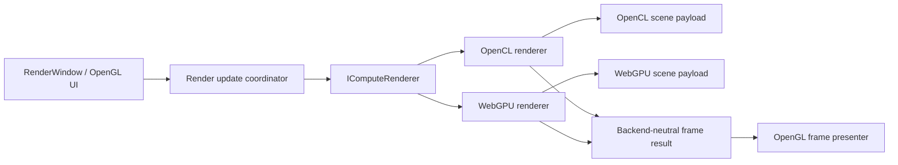

# WebGPU Compute Backend Parity Plan

## Objective

Deliver the native Dawn/WebGPU backend as a user-visible replacement for the OpenCL backend. A user must be able to select WebGPU on a platform without OpenCL and receive the same Gladius workflow: loading a model, editing it, receiving interactive and progressive previews, rendering thumbnails and MCP output, slicing/contouring, and exporting supported results.

OpenCL remains the default backend while the WebGPU backend is incomplete. Backend selection must never expose a configuration that starts the application but silently routes user operations through OpenCL or omits features.

## Definition of Parity

Parity means the same supported features, model semantics, UI states, failure reporting, and output quality. It does **not** mean cross-driver bit-identical pixels: floating-point behavior and compiler optimization differ across OpenCL, Vulkan, D3D12, and Metal. Shared fixtures define numerical and image tolerances per output type.

### Required User-Facing Capabilities

| Capability | OpenCL implementation today | WebGPU parity requirement |
|---|---|---|
| Main viewport | `RenderWindow` + `ComputeCore` + `RenderProgram` | Render all supported scenes and present frames in the unchanged OpenGL UI |
| Interactive previews | low-resolution, streaming, and realtime modes | Preserve coordinator behavior, cancellation, coalescing, and quality policy |
| Progressive HQ rendering | chunked rows, retained buffers, epoch invalidation | Equivalent chunking, cancellation, stale-result rejection, and progress reporting |
| Model evaluation | generated OpenCL plus command-stream paths | Generated WGSL with identical graph semantics and function-call behavior |
| Resources | mesh, beam lattice, images, VDB, precomputed SDF | Explicit WebGPU resource binding ABI and equivalent evaluation behavior |
| Slicing and contours | slicer/contour programs and image buffers | Equivalent slices, contours, and export inputs |
| MCP and thumbnails | `ComputeCore::createThumbnail*`, rendering tools | Backend-neutral headless rendering and image encoding |
| Configuration | OpenCL-specific implementation underneath settings | validated backend selection and actionable unsupported-capability errors |

## Current State

### Completed Foundations

- CMake/vcpkg Dawn toggles for Vulkan, D3D12, and Metal.
- Backend kind/configuration primitives.
- Headless Dawn device/context lifecycle.
- `ToWgslVisitor` for a growing analytic graph subset, parameter storage, matrices, and flattened function calls.
- Headless WebGPU slice dispatch/readback.
- Headless WebGPU camera ray marcher for analytic generated models.

### Explicitly Not Complete

- `RenderWindow`, `ComputeCore`, `RenderProgram`, `ResourceContext`, and `GLImageBuffer` remain OpenCL-specific.
- WebGPU frames are CPU-readback results and are not presented by the OpenGL viewport.
- There is no WebGPU equivalent of OpenCL render payloads, precomputed SDF, command-stream evaluation, resource-backed graph nodes, contour extraction, or export pipeline.
- `compute.backend=webgpu` must not be advertised as an application-wide backend until the capability contract is wired through the application.

## Architectural Direction

Introduce API-neutral contracts above the existing OpenCL objects. Do not make `RenderWindow` depend on Dawn, and do not retrofit Dawn handles into `ComputeContext`, `ResourceContext`, or `GLImageBuffer`.

### API-Neutral Types

Create a dedicated `compute` rendering layer with no OpenCL or Dawn types in public headers:

- `RenderCamera`: eye, orthonormal basis or transform, field of view, clipping values.
- `RenderSettingsSnapshot`: rendering flags and quality values in standard C++ types.
- `RenderViewport`: width, height, and requested row range.
- `RenderRequest`: immutable scene revision, camera/settings snapshot, viewport, rendering mode, and cancellation/freshness stamps.
- `RenderFrame`: RGBA pixels plus metadata: scene/view/parameter generation, completed row range, duration, and status.
- `IRenderSubmission`: polling, wait, cancellation, and result ownership.
- `IComputeRenderer`: capabilities, scene compilation/materialization, frame rendering, low-resolution rendering, precomputation, slice/contour operations, and error reporting.
- `ComputeBackendCapabilities`: discrete flags for analytic rendering, mesh SDF, beam lattice, image sampling, VDB, contours, export support, external texture presentation, and profiling.

Keep `IComputeBackend` focused on small backend-neutral jobs only until it can be folded into the renderer contract without breaking callers.

### Presentation Boundary

The UI must consume a backend-neutral `RenderFrame`, not `GLImageBuffer` or an OpenCL event. The initial portable bridge is:

1. backend writes to a GPU buffer/texture;
2. backend asynchronously produces CPU RGBA bytes;
3. an OpenGL-only presenter uploads the completed frame to the existing texture on the UI thread.

This provides feature parity on all platforms before optimizing transfer paths. Later add optional zero-copy/external-memory interop behind the same presenter interface when platform support permits it.

## Implementation Phases

### Phase 1 — Render Contract and OpenCL Adapter

**Goal:** Make existing behavior pass through API-neutral rendering interfaces without changing visual output.

1. Define the render request/result/submission/capability types in `src/compute`.
2. Implement `OpenCLComputeRenderer` as an adapter over the current `ComputeCore`/`RenderProgram` path.
3. Move OpenCL camera/settings conversion into the adapter; remove `cl_float3` and `cl_float16` from UI-facing session types.
4. Introduce an OpenGL frame presenter that accepts CPU RGBA frames while retaining the existing OpenCL interop implementation as an optimized path.
5. Route thumbnail and MCP rendering through the same renderer contract.

**Acceptance:** all existing OpenCL viewport, thumbnail, and MCP rendering tests retain their behavior with no WebGPU dependency.

### Phase 2 — Scheduling and Presentation Migration

**Goal:** Let the unchanged UI schedule backend-neutral work.

1. Replace `RenderWindow` calls to OpenCL methods/events/images with `IRenderSubmission` and `RenderFrame` metadata.
2. Preserve `RenderUpdateCoordinator`, epoch stamps, parameter generation, progressive buffer continuation rules, and stale-result handling.
3. Support row-range progressive frames, low-resolution frames, streaming frames, and exact realtime frames.
4. Ensure uploads/presentation occur only on the OpenGL UI thread.
5. Implement cancellation before GPU submission and stale-result discard after completion for both backends.

**Acceptance:** existing UI workflow/policy tests pass through the OpenCL adapter; no UI code directly accesses OpenCL queues, events, or image buffers.

### Phase 3 — WGSL Render Semantics

**Goal:** Match the analytic OpenCL renderer before resource-backed models.

1. Expand `ToWgslVisitor` to the full resource-independent graph set, including tested matrix arithmetic/inverse and gradient semantics.
2. Port ray-march semantics, camera transforms, normals, shading, shadows, clipping, rendering flags, and color behavior from `renderer.cl`/`rendering.cl`.
3. Implement WGSL low-resolution, distance-init, progressive-row, and metrics variants behind `IComputeRenderer`.
4. Add shared analytic fixture models with OpenCL/WebGPU image and SDF sample comparisons.

**Acceptance:** analytic model fixtures match OpenCL within documented color/distance tolerances for every rendering mode.

### Phase 4 — Scene Payload and Resource ABI

**Goal:** Materialize the same document state for both physical APIs.

1. Define API-neutral CPU scene payload snapshots: parameters, graph code, primitive metadata, meshes, beam lattices, image stacks, NanoVDB grids, command streams, and bounding/precomputed SDF data.
2. Implement `OpenCLScenePayload` from current `Primitives`/`ResourceContext` data without changing semantic ownership.
3. Implement `WebGPUScenePayload` buffers, textures, samplers, and bind-group layouts.
4. Port resource helper kernels and WGSL bindings for mesh distance, beam lattice distance, image sampling, VDB sampling, and resource metadata.
5. Implement explicit lifetime/version tracking per backend; never reuse or release buffers until the backend submission has reached a terminal state.

**Acceptance:** resource-backed graph fixtures render and evaluate consistently across both backends, with capability errors only for deliberately unsupported document features.

### Phase 5 — Slicing, Contours, and Export

**Goal:** Remove OpenCL as a dependency for manufacturing workflows.

1. Add backend-neutral slice and contour request/result contracts.
2. Port distance-map generation, marching squares/quadtree contour paths, and relevant GPU image operations to WebGPU.
3. Port or adapt mesh/dual-contouring sampling and export preparation.
4. Route slicer/export UI and MCP tools through the selected renderer/backend capabilities.
5. Preserve cancellation/progress and existing output metadata.

**Acceptance:** regression fixtures produce equivalent contours and successful exports using WebGPU alone.

### Phase 6 — Runtime Selection and Product Readiness

**Goal:** Make WebGPU a supported backend selection.

1. Parse and validate configured/CLI backend selection before document/renderer initialization.
2. Select the OpenCL or WebGPU scene renderer once per document/session.
3. Present clear capability diagnostics for documents requiring unavailable features.
4. Add fallback policy: automatic fallback is allowed only before work starts and must be visible to users; explicit WebGPU selection must not silently execute OpenCL work.
5. Add platform smoke tests: Linux/Vulkan, Windows/D3D12, macOS/Metal.

**Acceptance:** an OpenCL-free installation can open, edit, render, slice, thumbnail, and export all supported fixture models with WebGPU.

## Parity Test Strategy

### Fixture Classes

- Analytic SDF and color graphs.
- Modifiable scalar/vector/matrix parameters and nested function calls.
- Camera, clipping, lighting, shadows, and rendering-flag variants.
- Mesh SDF, beam lattice, image sampler, and VDB resources.
- Slices, contours, and exported geometry.
- UI workflows: resize, camera movement, parameter drag, cancellation, progressive continuation, and low-resolution-to-HQ handoff.

### Measurements

| Output | Requirement |
|---|---|
| Scalar SDF samples | absolute/relative tolerance defined per fixture |
| RGBA frame | pixel tolerance, mean error, and allowed outlier ratio |
| Contours | topology equality and geometric tolerance |
| Mesh/export | validity plus geometric/color tolerance |
| Scheduling | identical visible state transitions and no stale/torn frame presentation |

Use OpenCL output as the initial reference baseline, then preserve fixtures as implementation-independent expected artifacts. Tests must run with either backend independently where hardware is available.

## Non-Negotiable Constraints

- Preserve the existing OpenGL UI; WebGPU replaces compute, not the UI toolkit.
- Keep OpenCL default until the WebGPU capability set is complete.
- Do not expose a backend selector that produces a partial application experience.
- Do not hold UI-thread locks while waiting for compilation or GPU completion.
- Do not release/recycle a buffer while an associated OpenCL event or WebGPU submission can still access it.
- Keep all backend-specific includes and handles out of UI-facing/public render contracts.
- Prefer portable readback/upload presentation first; optimize interop only behind the presenter interface.

## Completion Criteria

The WebGPU backend is complete only when an OpenCL-free supported platform passes the defined parity suite and users can perform the same supported Gladius workflows without backend-specific UI limitations or silent fallback.
