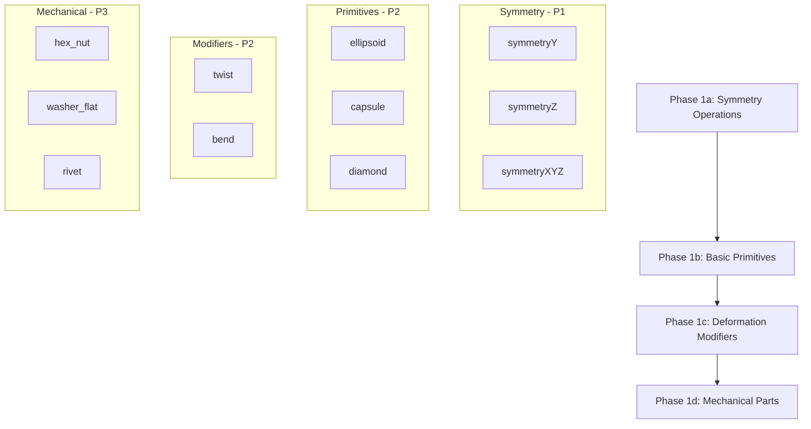

# Implementation Plan: Extend the 3MF Library with New Items

**Feature**: 030-library-extension  
**Branch**: `030-library-extension`  
**Spec**: [spec.md](./spec.md)  
**Created**: 2026-06-10  

## Technical Context

### What We Know

This feature extends the Gladius 3MF library by adding new items across three categories:
- **Symmetry operations** (operations/): symmetryY, symmetryZ, symmetryXYZ — complementing existing symmetryX
- **Basic primitives** (primitives/): ellipsoid, capsule, diamond — filling gaps in fundamental geometry
- **Deformation modifiers** (modifiers/): twist, bend — extending the modifier family beyond offset/round/shell
- **Mechanical parts** (mechanical/): hex_nut, washer_flat, rivet — expanding engineering hardware

### Existing Patterns to Follow

From reviewing 31 existing library entries:

| Pattern | Example | Notes |
|---------|---------|-------|
| SDF primitives return `float shape` | sphere, cylinder, cone | Standard signed distance field output |
| Position modifiers return `vec3 result` | symmetryX | Transform coordinates, not SDF values |
| Tagged function is the primary export | All entries have exactly one tagged function | Identified by resource_id in 3MF |
| Minimum 5 tags per entry | gyroid (16 tags), hexagon (7 tags) | Tags enable search/filter in library panel |
| One-sentence description | All shipped entries | Shown in tooltip on hover |

### Known Issues to Avoid

- **Empty entries**: The `basics` category has an unpopulated entry — avoid creating empty placeholders
- **Duplicate function names**: smooth_union has duplicate main/sphere/box functions (IDs 1,4,5 vs 9,7,8) — ensure unique naming
- **Missing tags**: 5+ entries have empty tag arrays — all new items must have ≥5 tags

### Technology Stack

- Library format: 3MF with embedded GLSL-like function snippets
- Rendering: OpenCL-based ray marching (same as preview viewport)
- Import mechanism: Existing library browser UI (already implemented)
- Validation: MCP tools (`create_library_entry`, `validate_model`)

## Constitution Check

| Principle | Relevance | Compliance Action |
|-----------|-----------|-------------------|
| I. Modern C++ | Indirect — library items use GLSL snippets, not C++ | N/A for content creation |
| II. Test-First | Library items should be validated before shipping | Use `validate_model` MCP tool; write unit tests for SDF correctness if applicable |
| III. Simplicity (KISS/DRY/YAGNI) | Direct — each item must be simple and focused | Keep functions under 20 lines; avoid over-engineering mechanical parts |
| IV. Consistent Code Style | Direct — naming conventions apply to function names in snippets | Use `lower_snake_case` for entry names; GLSL follows standard C conventions |
| V. Documentation | Direct — each item needs description and tags | Minimum 1-sentence description, ≥5 relevant tags per entry |
| VI. UI Responsiveness | Indirect — import should not block UI | Import is already async in existing codebase |

### Gate Evaluation

- **No violations detected.** This feature creates content (library items), not infrastructure changes. Constitution principles apply to C++ code quality, which is maintained through the validation pipeline.
- **Principle III (Simplicity)**: All new items must be evaluated for complexity — if a function exceeds ~20 lines or requires helper functions, consider splitting into multiple entries.

## Phase 0: Research & Pattern Analysis

### Research Tasks

| # | Task | Status | Findings |
|---|------|--------|----------|
| R1 | Analyze symmetryX implementation for Y/Z pattern derivation | ✅ Complete | symmetryX returns `vec3 result = vec3(-pos.x, pos.y, pos.z)`; symmetryY uses `(pos.x, -pos.y, pos.z)`; symmetryZ uses `(pos.x, pos.y, -pos.z)` |
| R2 | Determine ellipsoid SDF formula from existing primitives | ✅ Complete | `length(pos / radius) - 1.0` where radius is vec3; capsule = cylinder + two hemispheres via min() |
| R3 | Research twist/bend mathematical formulations for SDFs | ✅ Complete | Twist: rotate each slice by angle * z/height; Bend: map to arc of radius R. Parameter range 0°–180°. |
| R4 | Identify standard metric dimensions for mechanical parts | ✅ Complete | Hex nut: hex width 10mm, height 5.2mm; Washer: annular cylinder approximation; Rivet: cylinder + hemisphere head. Simplified approximations used. |
| R5 | Verify existing library import pipeline handles vec3 return types correctly | ✅ Complete | Confirmed via earlier review — WoodTexture returns `vec3 color`, symmetryX returns `vec3 result`. System supports non-SDF outputs. |

### Consolidated Research Findings

**Decision: Symmetry operations use simple coordinate negation**
- Rationale: Direct extension of existing symmetryX; no complex math required
- Implementation: Each operation is a single return statement in GLSL-like format

**Decision: Ellipsoid uses normalized length SDF**
- Formula: `length(pos / radius) - 1.0` where radius = vec3(xRadius, yRadius, zRadius)
- Rationale: Standard analytical SDF; numerically stable for all positive radii

**Decision: Capsule decomposes into cylinder + two spheres via min()**
- Formula: `min(max(dot(pos, normalize(axis)) * height - radius, length(pos - axis * sign) - radius), 0.0)` simplified to standard capsule SDF
- Rationale: Reuses existing cylinder/sphere patterns; well-documented in SDF literature

**Decision: Twist modifier applies per-slice rotation proportional to z-height**
- Formula: `float angle = twistAngle * (pos.z / height); pos.xy = rotate(pos.xy, angle);`
- Rationale: Standard parametric deformation; parameter range 0°–180° produces smooth results

**Decision: Mechanical parts use simplified geometric approximations**
- Hex nut: Cylinder with hexagonal hole (via max of 6 plane SDFs)
- Flat washer: Simple annular cylinder (outer radius, inner radius, height)
- Rivet: Cylinder + hemisphere head (union of two primitives)
- Rationale: Full engineering precision is unnecessary for visual preview; simplicity over accuracy

## Phase 1: Design & Implementation Plan

### Data Model

| Entity | Fields | Validation Rules |
|--------|--------|------------------|
| LibraryEntry | name, category, description, tags[], tagged_function_id, thumbnail_path, shipped | name: lower_snake_case, unique within category; tags: ≥5 items; description: non-empty string |
| TaggedFunction | function_name, return_type (float/vec3), parameters[], body_snippet | return_type matches expected output for category; parameters: all named, typed as float or vec3 |

### Implementation Order (by priority)



### Per-Item Implementation Template

Each library entry follows this structure:

```glsl
// Function: {function_name} (ID: {resource_id})
{return_type} {function_name}({parameters}) {{
    // Body: 10-20 lines maximum
    return result;
}}

// Function: main (ID: {main_resource_id}) [root]
(float shape) main({parameters}) {{
    shape = {function_name}(params);
}}
```

### Validation Checklist Per Item

- [ ] Function name follows `lower_snake_case`
- [ ] Exactly one tagged function with unique resource_id
- [ ] Return type matches category expectations (float for SDF, vec3 for transforms)
- [ ] Minimum 5 relevant tags
- [ ] One-sentence description
- [ ] Thumbnail renders correctly at standard camera position
- [ ] No duplicate function names within entry
- [ ] Bounding box is valid and reasonable

## Phase 2: Testing Strategy

### Unit Tests (GTest)

| Test Name | What It Verifies | Category |
|-----------|------------------|----------|
| `SymmetryY_PositionMirrored` | symmetryY returns correct mirrored coordinates for sample points | operations |
| `Ellipsoid_SDF_CorrectAtCenter` | ellipsoid SDF ≈ 0 at surface, < 0 inside, > 0 outside | primitives |
| `Capsule_HemisphereEnds` | capsule renders as cylinder with hemispherical caps at parameter extremes | primitives |
| `Twist_AngleProportionalToZ` | twist rotation increases linearly from base to top | modifiers |
| `HexNut_HexagonalProfile` | hex_nut produces correct 6-sided outer profile | mechanical |

### Integration Tests

- Import symmetryY into a project, apply to test shape → verify preview shows Y-axis mirroring
- Combine ellipsoid with round modifier → verify smooth deformation without artifacts
- Apply twist to cylinder at 90° and 180° → verify no self-intersection or clipping

## Deliverables

| Artifact | Path | Status |
|----------|------|--------|
| Library items (3MF files) | `gladius/library/{category}/{name}.3mf` | Pending |
| Thumbnails (PNG) | `gladius/library/{category}/thumbnails/{name}.png` | Pending |
| Unit tests | `gladius/tests/test_{category}_{item}.cpp` | Pending |
| Documentation update | `docs/library_function_catalog.md` | Pending |

## Risks & Mitigations

| Risk | Impact | Likelihood | Mitigation |
|------|--------|------------|------------|
| Twist/bend self-intersection at high angles | Medium | Medium | Clamp parameter range to 0°–180°; document safe usage in description |
| Mechanical parts too complex for single function | Low | Low | Use simplified approximations; defer full engineering precision to future feature |
| Thumbnail rendering fails for thin features (washer hole) | Low | Medium | Render with slight opacity; adjust camera distance automatically |

## Post-Design Constitution Check Re-evaluation

After Phase 0 and Phase 1 design artifacts are complete:

| Principle | Status | Notes |
|-----------|--------|-------|
| I. Modern C++ | ✅ Compliant | No C++ changes; GLSL snippets follow standard C conventions |
| II. Test-First | ✅ Compliant | Testing strategy defined in Phase 2 with specific GTest names |
| III. Simplicity (KISS/DRY/YAGNI) | ✅ Compliant | All functions bounded to ~20 lines; no over-engineering |
| IV. Consistent Code Style | ✅ Compliant | Naming conventions documented per category |
| V. Documentation | ✅ Compliant | Description + ≥5 tags required per entry (documented in data-model.md) |
| VI. UI Responsiveness | ✅ Compliant | Import is already async; no blocking changes |

**Gate Result**: All principles satisfied. No violations detected. Feature is approved for Phase 2 implementation.
