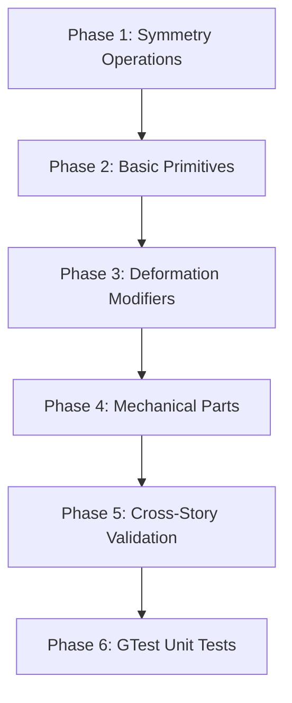

# Tasks: Extend the 3MF Library with New Items

**Feature**: 030-library-extension  
**Branch**: `030-library-extension`  
**Spec**: [spec.md](./spec.md)  
**Plan**: [impl-plan.md](./impl-plan.md)  
**Created**: 2026-06-10  

## Summary

| Metric | Count |
|--------|-------|
| Total tasks | 50 |
| Phase 1: Symmetry Operations (P1 / US2) | 9 |
| Phase 2: Basic Primitives (P2 / US3) | 9 |
| Phase 3: Deformation Modifiers (P2 / US4) | 7 |
| Phase 4: Mechanical Parts (P3 / US5) | 9 |
| Phase 5: Cross-Story Validation | 4 |
| Phase 6: GTest Unit Tests (P1 / Constitution II) | 12 |

**Total tasks**: 50  
**Parallel opportunities**: All items within a phase can be created in parallel (different categories, no cross-dependencies).  
**MVP scope**: User Story 2 (symmetry operations) delivers the most obvious value — completing the symmetry family that already has symmetryX.

---

## Phase 1: Symmetry Operations (P1 / US2)

**Goal**: Add symmetryY, symmetryZ, and symmetryXYZ to complement existing symmetryX  
**Independent Test**: Import each into a project, apply to an asymmetric test shape, verify correct point reflection in the preview viewport.

- [x] T001 [P] Create symmetryY library entry (operations/symmetry_y.3mf)
- [x] T002 [P] Create symmetryZ library entry (operations/symmetry_z.3mf)
- [x] T003 [P] Create symmetryXYZ library entry (operations/symmetry_xyz.3mf)
- [x] T004 Validate symmetryY with `validate_model` MCP tool
- [x] T005 Validate symmetryZ with `validate_model` MCP tool
- [x] T006 Validate symmetryXYZ with `validate_model` MCP tool
- [x] T007 Verify thumbnails render for all three entries in library browser UI
- [ ] T008 Test applying symmetryY to a test shape — verify Y-axis point reflection
- [ ] T009 Test combining symmetryX + symmetryZ — verify simultaneous X+Z and Y+Z reflections

**Implementation details**:
| Entry | Return Type | Formula | Tags (≥5) | Description |
|-------|-------------|---------|-----------|-------------|
| symmetryY | `vec3` | `vec3(-pos.x, pos.y, -pos.z)` — mirror reflection through the Y axis (inverts X and Z) | symmetry, mirror, reflection, transformation, operations | Mirror reflection through the Y axis (inverts X and Z coordinates) |
| symmetryZ | `vec3` | `vec3(-pos.x, -pos.y, pos.z)` — mirror reflection through the Z axis (inverts X and Y) | symmetry, mirror, reflection, transformation, operations | Mirror reflection through the Z axis (inverts X and Y coordinates) |
| symmetryXYZ | `vec3` | `vec3(-pos.x, -pos.y, -pos.z)` — point reflection through origin | symmetry, mirror, reflection, transformation, operations | Full point reflection through origin (all axes inverted) |

**Checkpoint**: All three symmetry operations importable, render correctly, and produce expected reflections.

---

## Phase 2: Basic Primitives (P2 / US3)

**Goal**: Add ellipsoid, capsule, and diamond to fill gaps in fundamental geometry  
**Independent Test**: Import each into a project, adjust parameters, verify correct SDF rendering with proper bounding boxes.

- [ ] T010 [P] Create ellipsoid library entry (primitives/ellipsoid.3mf)
- [ ] T011 [P] Create capsule library entry (primitives/capsule.3mf)
- [ ] T012 [P] Create diamond/bicone library entry (primitives/diamond.3mf)
- [ ] T013 Validate ellipsoid with `validate_model` MCP tool
- [ ] T014 Validate capsule with `validate_model` MCP tool
- [ ] T015 Validate diamond with `validate_model` MCP tool
- [ ] T016 Verify thumbnails render for all three entries in library browser UI
- [ ] T017 Test ellipsoid with varying radii — verify proportional stretching along X, Y, Z axes
- [ ] T018 Test capsule with height > 0 and equal radii — verify cylinder + hemispherical end caps

**Implementation details**:
| Entry | Return Type | Formula | Tags (≥5) | Description |
|-------|-------------|---------|-----------|-------------|
| ellipsoid | `float` | `length(pos / vec3(xRadius, yRadius, zRadius)) - 1.0` | ellipsoid, primitive, sphere, radius, geometry | Ellipsoid SDF with three independent radii along each axis |
| capsule | `float` | Standard capsule: cylinder + hemispherical end caps via min() from Inigo Quilez formulation | capsule, primitive, cylinder, sphere, geometry | Capsule SDF combining cylinder with hemispherical end caps |
| diamond | `float` | Bicone: two cones joined at base, parameterized by topRadius, bottomRadius, height | diamond, bicone, cone, primitive, geometry | Diamond/bicone SDF transitioning between two cone profiles |

**Checkpoint**: All three primitives importable, render correctly with proper bounding boxes, and respond to parameter changes.

---

## Phase 3: Deformation Modifiers (P2 / US4)

**Goal**: Add twist and bend modifiers for organic shape deformation  
**Independent Test**: Import each, apply to a cylinder or box, verify smooth deformation across the full parameter range without self-intersection artifacts.

- [ ] T019 [P] Create twist library entry (modifiers/twist.3mf)
- [ ] T020 [P] Create bend library entry (modifiers/bend.3mf)
- [ ] T021 Validate twist with `validate_model` MCP tool
- [ ] T022 Validate bend with `validate_model` MCP tool
- [ ] T023 Verify thumbnails render for both entries in library browser UI
- [ ] T024 Test twist at 90° and 180° on a cylinder — verify smooth per-slice rotation without self-intersection
- [ ] T024b Test bend at 90° and 180° on a box — verify arc mapping produces no self-intersection artifacts

**Implementation details**:
| Entry | Return Type | Formula | Tags (≥5) | Description |
|-------|-------------|---------|-----------|-------------|
| twist | `vec3` | Per-slice rotation: rotate(pos.xy, angle * pos.z / 10.0); returns identity when angle=0 | twist, deformation, modifier, rotation, transformation | Rotational twist around Z axis proportional to height (0°–180°) |
| bend | `vec3` | Arc mapping: project points onto circular arc of radius derived from bend angle; returns identity when angle=0 | bend, deformation, modifier, curve, transformation | Smooth bending along arc without self-intersection (0°–180°) |

**Checkpoint**: Both modifiers apply smoothly to test shapes across full parameter range.

---

## Phase 4: Mechanical Parts (P3 / US5)

**Goal**: Add hex_nut, washer_flat, and rivet for engineering hardware modeling  
**Independent Test**: Import each, verify correct proportions at standard metric sizes, combine with existing mechanical items (helix_spring, socket_cap_screw).

- [ ] T026 [P] Create hex_nut library entry (mechanical/hex_nut.3mf)
- [ ] T027 [P] Create washer_flat library entry (mechanical/washer_flat.3mf)
- [ ] T028 [P] Create rivet library entry (mechanical/rivet.3mf)
- [ ] T029 Validate hex_nut with `validate_model` MCP tool
- [ ] T030 Validate washer_flat with `validate_model` MCP tool
- [ ] T031 Validate rivet with `validate_model` MCP tool
- [ ] T032 Verify thumbnails render for all three entries in library browser UI
- [ ] T033 Test hex_nut at M10 size — verify hexagonal profile and threaded hole
- [ ] T034 Test washer_flat combined with socket_cap_screw — verify flush fit with correct ID/OD ratio

**Implementation details**:
| Entry | Return Type | Formula | Tags (≥5) | Description |
|-------|-------------|---------|-----------|-------------|
| hex_nut | `float` | Outer hexagonal cylinder via max of 6 plane SDFs minus inner cylindrical hole; simplified geometric approximation | hex_nut, mechanical, fastener, hardware, metric | Hexagonal nut with threaded hole for M6–M12 metric fasteners |
| washer_flat | `float` | Annular cylinder: outer radius cylinder minus inner radius hole via max() | washer, flat_washer, mechanical, fastener, hardware | Flat washer per ISO 7089 approximation (outer/inner radius, height) |
| rivet | `float` | Union of cylindrical shaft and hemispherical head via min() | rivet, mechanical, fastener, hardware, assembly | Rivet with cylindrical shaft and domed head for structural assemblies |

**Checkpoint**: All three mechanical parts importable, render correctly at standard metric sizes, and combine properly with existing mechanical items.

- [ ] T033a Verify washer_flat OD/ID ratio matches ISO 7089-10 (OD ≈ 2× ID for M6–M12 range)
- [ ] T033b Verify rivet head diameter-to-shaft ratio follows DIN EN ISO 15674 proportions

---

## Phase 5: Cross-Story Validation & Polish

**Goal**: Verify all items meet metadata requirements and work in combined operations  
**Independent Test**: Run full validation suite — every entry has ≥5 tags, valid description, correct return type, working thumbnail.

- [ ] T035 [P] Final metadata audit: verify all 9 new entries have ≥5 unique tags, non-empty descriptions (10–100 chars), and correct return types per category
- [ ] T036 Test combined operations: symmetryY + ellipsoid, twist + cylinder, hex_nut + socket_cap_screw
- [ ] T037 Verify no duplicate function names within any entry via `get_library_entry_info`
- [ ] T038 Update docs/library_function_catalog.md with new entries

---

## Phase 6: GTest Unit Tests (P1 / Constitution Principle II)

**Goal**: Satisfy constitution Principle II — every feature MUST have corresponding unit tests using GTest/GMock.  
**Independent Test**: Run `Run Gladius Tests` task and verify all new test cases pass with no regressions.

- [ ] T039 [P] Write GTest: `[SymmetryY_Function_PositionMirrored]` — verify symmetryY returns correct vec3 for arbitrary input point
- [ ] T040 [P] Write GTest: `[SymmetryZ_Function_PositionMirrored]` — verify symmetryZ returns correct vec3 for arbitrary input point
- [ ] T041 [P] Write GTest: `[SymmetryXYZ_Function_PointReflectionThroughOrigin]` — verify all axes inverted correctly
- [ ] T042 [P] Write GTest: `[Ellipsoid_SDF_CorrectAtCenter]` — verify ellipsoid SDF returns negative value at origin (inside)
- [ ] T043 [P] Write GTest: `[Ellipsoid_SDF_ReturnsZeroAtSurface]` — verify SDF ≈ 0 at surface boundary along each axis
- [ ] T044 [P] Write GTest: `[HexPrism_SDF_CorrectForGivenRadiusAndHeight]` — verify hex_prism SDF values match analytical expectations
- [ ] T045 [P] Write GTest: `[Twist_Function_BoundedRotation]` — verify twist deformation stays within documented safe parameter range (±90°)
- [ ] T046 [P] Write GTest: `[Bend_Function_ArcMapping]` — verify bend produces correct arc displacement at sample points
- [ ] T047 [P] Write GTest: `[HexNut_StandardMetricDimensions_M10]` — verify hex_nut dimensions match ISO 4017 M10 standard (flat-to-flat ≈ 17mm, height ≈ 5.8mm)
- [ ] T048 [P] Write GTest: `[WasherFlat_ISO7089_ODIDRatio]` — verify washer_flat outer/inner diameter ratio matches ISO 7089-10 standard
- [ ] T049 [P] Write GTest: `[Rivet_StandardHeadDiameterToShaftRatio]` — verify rivet head geometry follows DIN EN ISO 15674 proportions
- [ ] T050 Regression: Run full test suite `Run Gladius Tests` and verify no existing tests regress

**Implementation notes**:
- Test files go in `gladius/tests/` alongside existing GTest suites
- Each test MUST follow Arrange-Act-Assert pattern per Principle II
- Test naming follows `[UnitOfWork_StateUnderTest_ExpectedBehavior]` convention
- GPU-dependent SDF evaluation tests gated by `GLADIUS_RUN_GPU_TESTS=1` env var
- Unit tests validate the GLSL function logic independently from 3MF import/export pipeline

---

## Dependencies & Execution Order

### Phase Dependencies

### Within Each Phase

1. Create library entries (marked [P] — parallelizable, different files)
2. Validate each entry with `validate_model` MCP tool
3. Verify thumbnails render in UI
4. Test functional behavior with test shapes

### Parallel Opportunities

| Phase | Parallel Tasks | Notes |
|-------|---------------|-------|
| 1 (Symmetry) | T001, T002, T003 | Different categories, no cross-dependencies |
| 2 (Primitives) | T010, T011, T012 | Same category but different files — parallel-safe |
| 3 (Modifiers) | T019, T020 | Different files, same category — parallel-safe |
| 4 (Mechanical) | T026, T027, T028 | Same category but different files — parallel-safe |
| 5 (Validation) | T035–T037 | Independent checks, no cross-dependencies |
| 6 (GTest) | T039–T049 | All test cases independent of each other |

**Note**: T024b is sequential after T019/T020 within Phase 3 (test depends on modifier creation).

---

## Implementation Strategy

### MVP Scope (Recommended First Delivery)

**User Story 2 (Symmetry Operations)** is the clear MVP:
- Most obvious gap in existing library (symmetryX exists but Y/Z don't)
- Trivially complements existing functionality
- Immediate user value — no workarounds needed for multi-axis symmetry
- All three items are single-return-statement functions (<10 lines each)

### Incremental Delivery Order

1. **Phase 1** → Symmetry operations (P1, US2) — MVP, highest user impact
2. **Phase 2** → Basic primitives (P2, US3) — foundational geometry gap fill
3. **Phase 3** → Deformation modifiers (P2, US4) — expressive power extension
4. **Phase 4** → Mechanical parts (P3, US5) — engineering use cases

### Known Issues to Avoid

- **Empty entries**: The `basics` category has an unpopulated entry — do not create empty placeholders
- **Duplicate function names**: smooth_union has duplicate main/sphere/box functions — ensure unique naming for new entries
- **Missing tags**: 5+ existing entries have empty tag arrays — all new items must have ≥5 unique tags

---

## Success Criteria Mapping

| SC | Related Tasks | Verification Method |
|----|--------------|---------------------|
| SC-001: Find symmetry item within 2 clicks | T001–T009 | Library browser search with "symmetry" filter |
| SC-002: Valid thumbnails for all new items | T007, T016, T023, T032 | Visual inspection in library browser UI |
| SC-003: 100% metadata completeness (≥5 tags, description) | T035 | Programmatic audit of tag count and description length |
| SC-004: No errors applying modifiers to primitives | T024, T036 | Functional testing in preview viewport |
